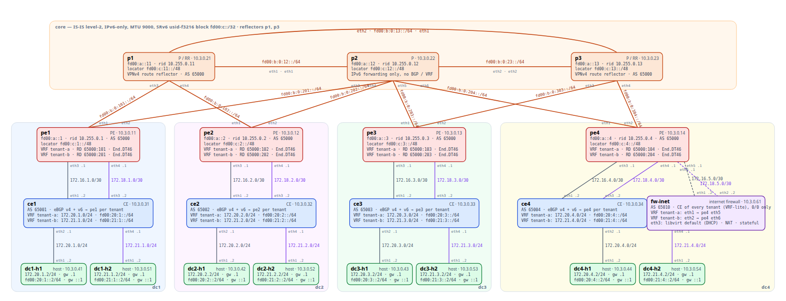
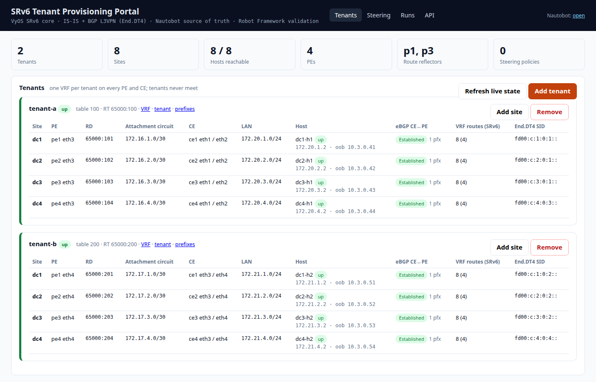
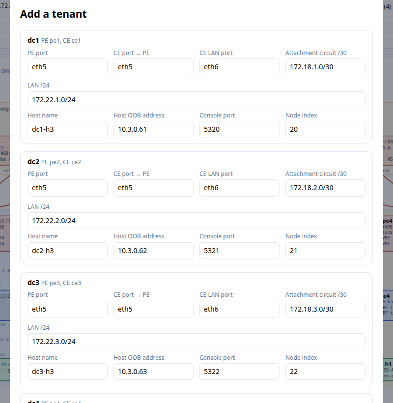
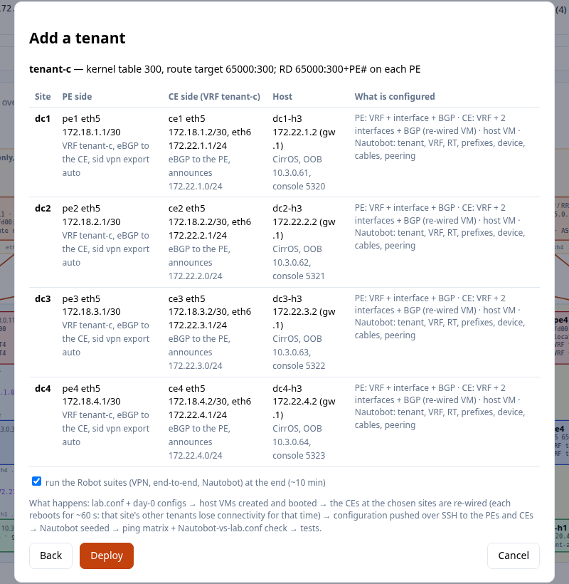
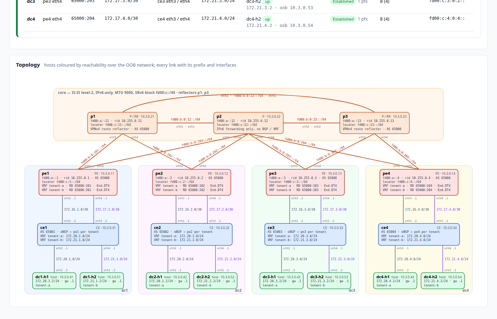
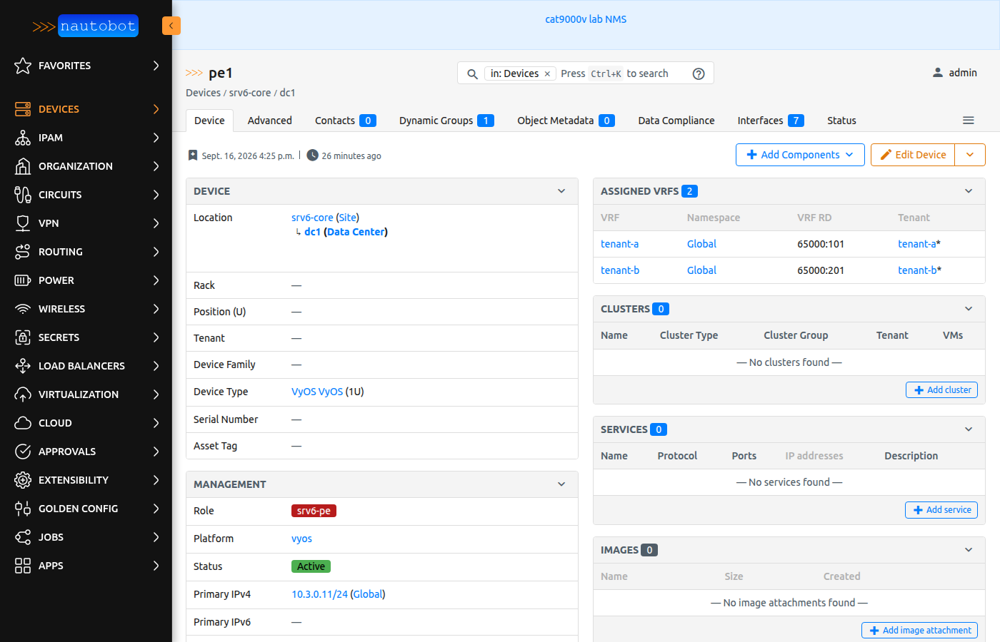
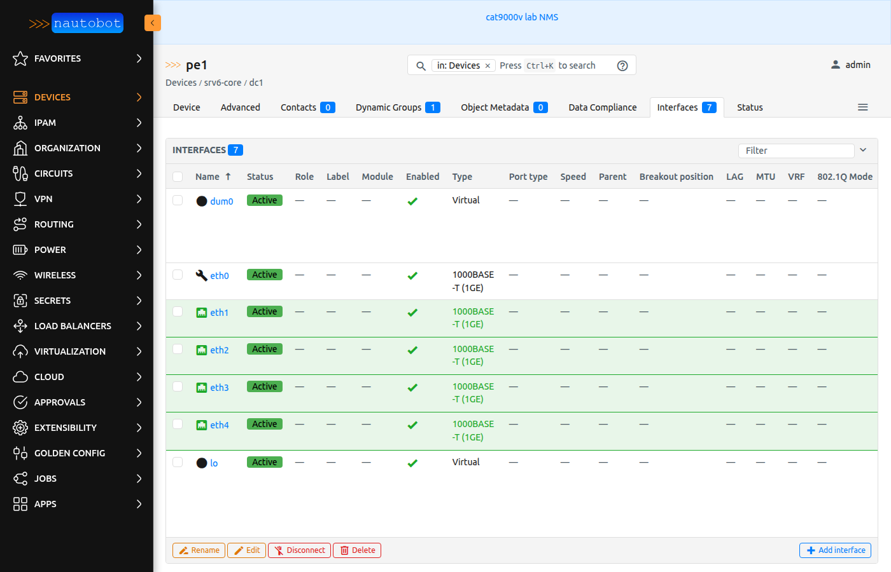
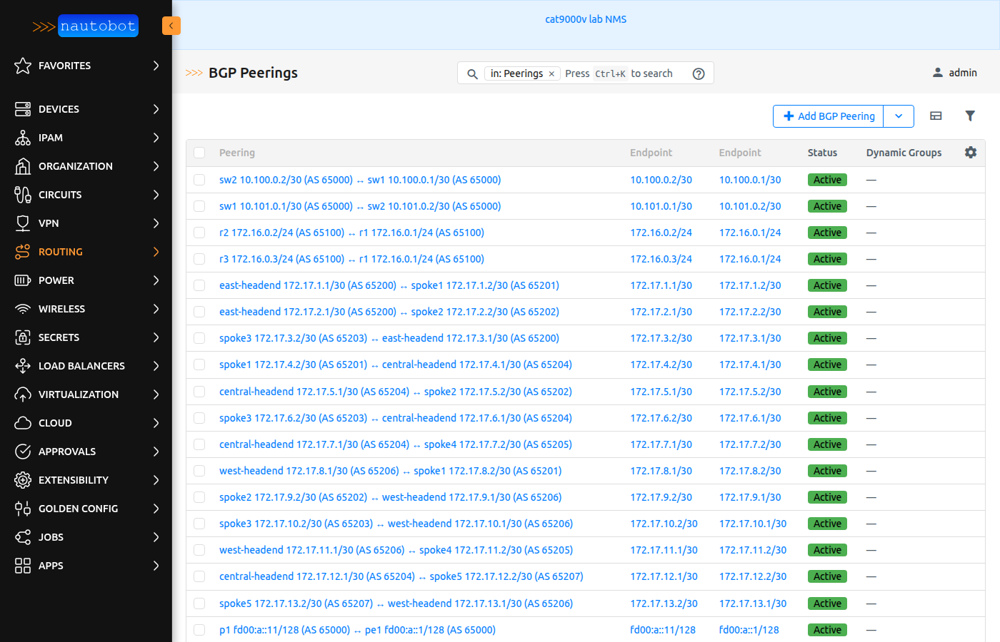
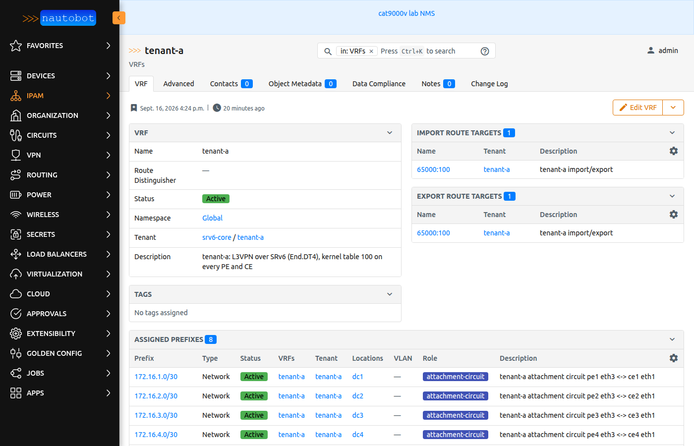

# SRv6 WAN core lab — VyOS PEs, a P-router triangle and BGP L3VPN over SRv6

A segment-routing-over-IPv6 service-provider core simulated on one Linux host with libvirt/KVM: four **VyOS PEs**
(one per data centre), three **VyOS P routers** in a triangle (p1 and p3 are also VPNv4 route reflectors), a **VyOS CE**
per data centre serving **two tenants** — `tenant-a` (host h1) and `tenant-b` (host h2) — each in its own VRF on the
CE and over its own attachment circuit into its own VRF on the PE, and an **Alpine Linux host** (iperf3, tcpdump, mtr)
per tenant per site. The core is IPv6-only with IS-IS level-2 carrying the SRv6 locators; each tenant's IPv4 prefixes travel
as BGP VPNv4 routes whose next hop is that tenant's **SRv6 End.DT46 SID** on the remote PE, so every h1 reaches every
other h1, every h2 every other h2, and the two never meet — not even at the same site. A small **VyOS firewall** (`fw-inet`)
is a CE of both tenants on pe4 and gives every site a NATed way out to the internet through the host's own uplink. Twenty VMs
(plus one CirrOS host per site per extra tenant), about 14 GiB of RAM, all VyOS nodes 1 vCPU / 1 GiB.

```
 hosts (Alpine)   dc1-h1 172.20.1.2  dc1-h2 172.21.1.2   … the same in dc2, dc3, dc4 (172.20.n / 172.21.n)
                   | eth2 (VRF tenant-a) | eth4 (VRF tenant-b)
 CEs   (VyOS)     ce1 AS65001 — eBGP to pe1 once per tenant      ce2 AS65002         ce3 AS65003         ce4 AS65004
                   | eth1 172.16.n.0/30 → PE VRF tenant-a          |                   |                   |
                   | eth3 172.18.n.0/30 → PE VRF tenant-b          |                   |                   |
 PEs   (VyOS)     pe1 fd00:c:1::/64     pe2 fd00:c:2::/64              pe3 fd00:c:3::/64     pe4 fd00:c:4::/64
                   |    \      /    |                                   |    \      /    |
 P core (VyOS)    p1 (RR) ---------- p2 ------------------------------ p3 (RR)  IS-IS L2, IPv6-only, MTU 9000
                  fd00:a::11         fd00:a::12                        fd00:a::13
```
pe1/pe2 are dual-homed to p1+p2, pe3/pe4 to p2+p3, so every west↔east path crosses p2 (the tests use that).



Orange links are the IPv6 core (IS-IS, SRv6); grey and purple are the tenant-a and tenant-b access links (IPv4).
Every box carries the node's loopback, router-id, locator, AS and VRFs/RDs; every link its prefix and both interface
names. Generated from `lab.conf` by `docs/topology.py`; the same drawing with the tables below is
[docs/topology.pdf](docs/topology.pdf).

## Quick start
```bash
./lab.sh up            # define the OOB network, build the overlay disks / cloud-init seeds, start 15 VMs
./lab.sh bootstrap     # first boot only: push nodes/<n>/vyos_config.txt over the serial consoles (all in parallel, ~4 min)
./lab.sh wait          # SSH on every node
./lab.sh verify        # IS-IS adjacencies, SRv6 nodes and SIDs, VPNv4 at the RR, VRF routes, CE routes, host ping matrix
./lab.sh test          # Robot Framework, results/<timestamp>/report.html
./lab.sh down          # ACPI shutdown; configs are saved, the next `up` converges without bootstrap
```
Credentials: VyOS `vyos`/`vyos` (`./lab.sh ssh pe1`), hosts `lab`/`lab` (`./lab.sh ssh dc1-h1`); consoles
`./lab.sh console <node>`. The whole thing comes up in about six minutes from cold.

## The design
| Layer | What | Where |
|---|---|---|
| Underlay | IPv6-only, IS-IS level-2 point-to-point on every core link (`fd00:b::/48`, one /64 per link, MTU 9000), loopbacks `fd00:a::/48` | every PE and P |
| SRv6 | **uSID** (`format usid-f3216`, `behavior-usid`): one /48 locator per node from the /32 block `fd00:c::/32` (block 32 / node 16 / function 16 bits), advertised by IS-IS (`segment-routing srv6`); the local SIDs live on `dum0` (addressed /128 so its connected route never outranks the uN in zebra); encapsulation source = loopback | every PE and P |
| Service | one VRF per tenant on every PE — `tenant-a` (table 100, RT 65000:100, RD 65000:10*n*) and `tenant-b` (table 200, RT 65000:200, RD 65000:20*n*) — each with its own attachment circuit and eBGP session to the CE, VPNv4 to the route reflector over the IPv6 loopbacks with `capability extended-nexthop`, `sid vpn export auto` → one End.DT4 SID per tenant | PEs |
| Route reflection | p1 **and p3**, each with peer-group `RR-CLIENTS`, VPNv4 only; every PE peers with both and holds each VPN route twice (different cluster-ids), so losing a reflector changes nothing — p2 runs no BGP and knows nothing about the tenants | p1, p3 |
| Access | the CE keeps the tenants apart too: VRF `tenant-a` (eth1 to the PE, eth2 LAN `172.20.n.0/24`, host h1) and VRF `tenant-b` (eth3 to the PE, eth4 LAN `172.21.n.0/24`, host h2); each VRF runs its own eBGP session announcing its LAN and learning the other three; the CE's default VRF carries only OOB management (plus the empty default BGP instance VyOS insists on while VRF instances exist) | CEs, hosts |

What the data plane looks like on a PE (`sudo ip route show vrf tenant-a` / `sudo ip -6 route | grep seg6local`):
```
172.20.3.0/24   encap seg6 mode encap segs 1 [ fd00:c:3:e000:: ] via fe80::... dev eth2  # remote LAN → pe3's uDT4 (tenant-a)
fd00:c:1::/48   encap seg6local action End flavors next-csid lblen 32 nflen 16          # uN: the node's micro-SID (IS-IS)
fd00:c:1:e000:: encap seg6local action End.X nh6 fe80::... oif eth2 flavors next-csid   # uA: one per adjacency (IS-IS)
fd00:c:1:e002:: encap seg6local action End.DT46 vrftable tenant-a                       # uDT46: one per tenant VRF, IPv4 and IPv6 (BGP)
fd00:c:1:e003:: encap seg6local action End.DT46 vrftable tenant-b
```
`show segment-routing srv6 sid` in vtysh lists them as uN / uA / uDT4. Function values are allocated by FRR at run time
(they can change after a reconfiguration); the tests only assert that a SID lies inside the right locator.

**Why uSID.** With a 32-bit block and 16-bit node ids, up to six micro-SIDs pack into one 128-bit segment: the steered path
p1 → p3 → pe3 (tenant-b) is the single address `fd00:c:11:13:3:e001::`. Each uN owner shifts the address left by 16 bits
(the kernel's NEXT-C-SID flavour): p1 forwards `fd00:c:13:3:e001::`, p3 forwards `fd00:c:3:e001::`, pe3 decapsulates with
its uDT4 `e001`. The SRH shrinks from three segments (56 bytes) to one (24 bytes) — and only the destination address changes
per hop. `steer add … --uncompressed` installs the classic three-address list for comparison; suite 07 checks both. The
uncompressed format (`SRV6_FORMAT=uncompressed-f4024`, /64 locators from a /40) is still supported by the renderer and tests.

### The one thing that is not in the textbook
Linux (6.18 here) scopes the **outer IPv6 lookup of the SRv6 encapsulation to the ingress VRF's table for forwarded
packets** — locally generated traffic from the PE works, traffic coming in from the CE is dropped with
`Ip6OutNoRoutes`. Each PE therefore leaks the remote locators into every tenant VRF table as static routes whose next
hops are the loopbacks of the attached P routers **on the IGP shortest path** (computed by `gen_configs.py` from the
topology, resolved recursively through IS-IS so a dead P drops out), plus the whole block via every attached P as the
fallback:
```
set vrf name tenant-a protocols static route6 fd00:c:3::/64 next-hop fd00:a::12 vrf default   # pe1 → pe3: via p2 only
set vrf name tenant-a protocols static route6 fd00:c:2::/64 next-hop fd00:a::11 vrf default   # pe1 → pe2: ECMP p1 / p2
set vrf name tenant-a protocols static route6 fd00:c:2::/64 next-hop fd00:a::12 vrf default
set vrf name tenant-a protocols static route6 fd00:c::/40 next-hop fd00:a::11 vrf default     # fallback
set vrf name tenant-a protocols static route6 fd00:c::/40 next-hop fd00:a::12 vrf default
```
A plain `/40` leak alone works but hashes forwarded flows across both Ps regardless of IGP cost (pe3→pe1 would go
via p3→p1 half the time); per-locator entries keep the forwarding plane consistent with IS-IS. (Leaking through BGP
`import vrf default` does not work: the IS-IS next hops are link-local and fail nexthop validation.)

## Addressing
| Node | Role | OOB (srv6-oob) | Loopback | Router-id | IS-IS NET | SRv6 locator | AS |
|---|---|---|---|---|---|---|---|
| pe1 | pe | 10.3.0.11 | fd00:a::1 | 10.255.0.1 | 49.0001.0000.0000.0001.00 | fd00:c:1::/48 | 65000 |
| pe2 | pe | 10.3.0.12 | fd00:a::2 | 10.255.0.2 | 49.0001.0000.0000.0002.00 | fd00:c:2::/48 | 65000 |
| pe3 | pe | 10.3.0.13 | fd00:a::3 | 10.255.0.3 | 49.0001.0000.0000.0003.00 | fd00:c:3::/48 | 65000 |
| pe4 | pe | 10.3.0.14 | fd00:a::4 | 10.255.0.4 | 49.0001.0000.0000.0004.00 | fd00:c:4::/48 | 65000 |
| p1 | p (RR) | 10.3.0.21 | fd00:a::11 | 10.255.0.11 | 49.0001.0000.0000.0011.00 | fd00:c:11::/48 | 65000 |
| p2 | p | 10.3.0.22 | fd00:a::12 | 10.255.0.12 | 49.0001.0000.0000.0012.00 | fd00:c:12::/48 | – |
| p3 | p (RR) | 10.3.0.23 | fd00:a::13 | 10.255.0.13 | 49.0001.0000.0000.0013.00 | fd00:c:13::/48 | 65000 |
| ce1..ce4 | ce | 10.3.0.31-34 | – | 172.20.*n*.1 (tenant-a) / 172.21.*n*.1 (tenant-b) | – | – | 6500*n* |
| fw-inet | fw (internet breakout) | 10.3.0.61 | – | 172.16.5.2 (tenant-a) / 172.18.5.2 (tenant-b) / 10.3.0.61 (default VRF) | – | – | 65010 |
| dc*n*-h1 | host (tenant-a) | 10.3.0.41-44 | – | – | – | – | – |
| dc*n*-h2 | host (tenant-b) | 10.3.0.51-54 | – | – | – | – | – |

| Link | Prefix | First end (::1 / .1) | Second end (::2 / .2) |
|---|---|---|---|
| p1–p2, p1–p3, p2–p3 | fd00:b:0:12::/64, fd00:b:0:13::/64, fd00:b:0:23::/64 | p1 eth1, p1 eth2, p2 eth2 | p2 eth1, p3 eth1, p3 eth2 |
| p1–pe1, p1–pe2 | fd00:b:0:101::/64, fd00:b:0:102::/64 | p1 eth3, p1 eth4 | pe1 eth1, pe2 eth1 |
| p2–pe1, p2–pe2, p2–pe3, p2–pe4 | fd00:b:0:201::/64 … fd00:b:0:204::/64 | p2 eth3 … eth6 | pe*n* eth2 (pe1/pe2), eth1 (pe3/pe4) |
| p3–pe3, p3–pe4 | fd00:b:0:303::/64, fd00:b:0:304::/64 | p3 eth3, p3 eth4 | pe3 eth2, pe4 eth2 |
| pe*n*–ce*n* tenant-a | 172.16.*n*.0/30 | pe*n* eth3 | ce*n* eth1 |
| pe*n*–ce*n* tenant-b | 172.18.*n*.0/30 | pe*n* eth4 | ce*n* eth3 |
| ce*n*–dc*n*-h1 | 172.20.*n*.0/24 | ce*n* eth2 (gateway) | dc*n*-h1 eth1 |
| ce*n*–dc*n*-h2 | 172.21.*n*.0/24 | ce*n* eth4 (gateway) | dc*n*-h2 eth1 |
| pe4–fw-inet tenant-a, tenant-b (internet breakout, IPv4 only) | 172.16.5.0/30, 172.18.5.0/30 | pe4 eth5, pe4 eth6 | fw-inet eth1, fw-inet eth2 |
| fw-inet eth3 | libvirt `default` (192.168.122.0/24, DHCP) | the host's NAT network = the internet | – |
| headend–pe*n* tenant-a (external CE, IPsec lab — when attached) | 172.19.*n*.0/30 | east/central/west-headend GigabitEthernet3 | pe1/pe2/pe3 eth5 |

**Dual-stack**: every tenant link has an IPv6 twin derived by rule from the IPv4 prefix — `172.X.Y.0/…` → `fd00:X:Y::/64`
(attachment circuit `172.16.1.0/30` ↔ `fd00:16:1::/64`, LAN `172.20.1.0/24` ↔ `fd00:20:1::/64`; first end `::1`, second `::2`,
host `::2`). `lab.conf` keeps the IPv4 `LINKS`; `lab.sh inventory` carries `ip6` / `prefix6` explicitly. Each VRF runs one eBGP
session per family to the CE, VPNv4 **and VPNv6** to both reflectors, and **one End.DT46 SID per VRF** (`sid vpn per-vrf export
auto`) that decapsulates both families — the same SID and transposed label appear on `172.20.3.0/24` and `fd00:20:3::/64`.

VRFs: `tenant-a` table 100, RT 65000:100, RD 65000:10*n*; `tenant-b` table 200, RT 65000:200, RD 65000:20*n* (*n* = PE
number). OOB network `srv6-oob` 10.3.0.0/24, host 10.3.0.1; serial consoles 127.0.0.1:5301–5320 (5320 = fw-inet).

Links: core `fd00:b:0:<ab>::/64` (`ab` = the two node numbers, e.g. p1–p2 `fd00:b:0:12::/64`, p2–pe1 `fd00:b:0:201::/64`);
tenant-a: PE–CE `172.16.n.0/30` (PE .1), CE–host `172.20.n.0/24`; tenant-b: PE–CE `172.18.n.0/30`, CE–host `172.21.n.0/24`
(CE .1 = gateway, host .2). A fourth token on a `LINKS` entry names the tenant. The first end of a link in
`lab.conf` gets the first address. `./lab.sh status` prints every link with both addresses, `./lab.sh inventory`
the whole lab as JSON (what the tests read; a future Nautobot seed would too).

### Throughput (`./lab.sh iperf`)
The hosts run Alpine Linux with iperf3 (base image built once by `tools/build_host_image.sh` from the Alpine NoCloud
cloud-init image; per-host overlays with a NoCloud seed carrying static addresses; user `lab`/`lab`).
`./lab.sh iperf dc1-h1 dc3-h1` measures across the core; `./lab.sh iperf --scenarios` compares the shortest path with a
steered path as a uSID carrier and as an uncompressed SRH. What a 1 vCPU VyOS software data plane over UDP-tunnelled
links gives on this host:

| dc1 → dc3, TCP 5 s | Mbit/s |
|---|---|
| shortest path (pe1 → p2 → pe3) | ~140 |
| steered pe1 → p1 → p3 → pe3, one uSID segment | ~120 |
| steered, uncompressed three-segment SRH | ~120 |
| UDP at 20 Mbit/s | 0 % loss, jitter < 0.1 ms |

Suite 10 asserts a floor (30 Mbit/s), UDP loss/jitter at a fixed rate, and that steering / uSID do not collapse throughput;
the portal has a **Throughput** button per tenant (`GET /api/iperf`).

### Explicit-path steering (traffic engineering)
`./lab.sh steer add pe1 tenant-b 172.21.3.0/24 p1 p3` pins a tenant prefix on a PE to the path p1 → p3 → pe3 — the long
way round the triangle instead of the IGP path via p2. It is a static route in the tenant VRF (`interface eth1 vrf default
segments …`, the uDT4 SID read live from the destination PE); with uSID the tool packs the path into one carrier segment
`fd00:c:11:13:3:e001::`, with `--uncompressed` (or uncompressed locators) it installs `[p1 End, p3 End, pe3 End.DT46]`.
`steer del` removes it, `steer show` lists policies. On the wire p1 forwards `IP6 fd00:a::1 > fd00:c:13:3:e001::` (its own
micro-SID consumed), p3 forwards `… > fd00:c:3:e001::`, and p2 sees nothing; the reply still takes the shortest path back
(asymmetric, as intended). Suite 07 does exactly this and cleans up.

### Fast failure detection
The point-to-point links are UDP tunnels that never lose carrier, so a dead neighbour is only visible through the
protocol — with plain IS-IS timers that is the 30 s hold time. Every core adjacency therefore runs **BFD** (`isis
interface ethN bfd`, 300 ms × 3). Suite 08 cuts the p2–pe3 link silently (a firewall drop on p2's interface, carrier
stays up), and a 0.2 s ping across the core loses **4 packets** while pe3 reroutes through p3; the link is then
restored and every session comes back. (Admin-disabling the interface instead leaves one FRR BFD session stuck until
it is toggled — hence the firewall-style cut.)

## Packet walk: dc1-h1 → dc3-h1 (tenant-a, dc1 → dc3)
1. **dc1-h1** 172.20.1.2 sends to 172.20.3.2 via its gateway **ce1** 172.20.1.1 (VRF tenant-a on the CE).
2. **ce1** has 172.20.3.0/24 from pe1 over that VRF's eBGP session → forwards to **pe1** 172.16.1.1 (VRF tenant-a on the PE).
3. **pe1**: the VRF route `172.20.3.0/24 encap seg6 segs 1 [ fd00:c:3:e000:: ]` is the uDT4 SID pe3 exported with the
   VPNv4 route (RD 65000:103, RT 65000:100, next hop fd00:a::3) via the reflectors p1 and p3. pe1 wraps the packet in
   `IPv6 fd00:a::1 → fd00:c:3:e000::` + SRH.
4. **p2** (the only shortest path west→east) forwards plain IPv6 towards pe3's locator `fd00:c:3::/48` learned from
   IS-IS — no VRF, no IPv4 knowledge.
5. **pe3**: its local SID `seg6local End.DT46 vrftable tenant-a` decapsulates and looks the inner packet up in the VRF →
   **ce3** 172.16.3.2 → **dc3-h1**.
6. The reply mirrors the path with pe1's SID. A packet from **dc1-h2** (tenant-b) takes the same core path but enters
   through CE VRF tenant-b, the second attachment circuit, PE VRF tenant-b and pe3's *other* End.DT46 SID; it can never
   reach a tenant-a address because no tenant-a route exists in any tenant-b table (different RTs).

### Local SIDs on a PE (pe1)
| SID | Behaviour | Installed by |
|---|---|---|
| `fd00:c:1::/48` | uN — the node's micro-SID (End with the NEXT-C-SID flavour: shift left 16 bits and forward) | IS-IS |
| `fd00:c:1:e000::`, `fd00:c:1:e001::` | uA — End.X per core adjacency (eth2 → p2, eth1 → p1) | IS-IS |
| `fd00:c:1:e002::`, `fd00:c:1:e003::` | uDT46 — End.DT46 → VRF tenant-a, → VRF tenant-b (one per tenant, both families) | BGP (`sid vpn export auto` in each VRF) |

Locator structure (usid-f3216): block 32 bits · node 16 bits · function 16 bits; the function values are allocated by FRR at
run time (they can change after a reconfiguration), which is why the tests only ever assert that a SID lies inside the right locator.

## The tenant provisioning portal
`./lab.sh webapp` (or the systemd user unit `srv6-webapp`) serves **http://192.168.50.231:8091** — Swagger at `/docs`.
The run engine (steps, streamed log, resume, Robot reports) comes from the shared
[lab-portal](https://github.com/dcantor/lab-portal) package, which also serves the **lab hub** at
**http://192.168.50.231:8088**: every lab on the host with its VMs, portal health, last tests and links.

| View | What it does |
|---|---|
| Tenants | one card per tenant with its sites: PE port, RD, attachment circuit, CE ports, LAN, host — joined with live state from the PEs (eBGP session to the CE, prefixes received, VRF / SRv6 route counts, the tenant's End.DT4 SID) and host reachability; the topology drawn live (hosts coloured by reachability); links into Nautobot (VRF, tenant, prefixes) |
| Add tenant | a 3-step wizard: name / kernel table / route target / sites (all suggested: next letter, next table, `65000:<table>`), then the per-site allocation — attachment circuit `/30` and LAN `/24` from the tenant's blocks (`172.(16+i)` / `172.(20+i)`), the next free PE and CE ports, a CirrOS host (name, OOB address, console, node index) — editable and re-validated against the running lab, then a review and **Deploy** |
| Add site | the same wizard for an existing tenant and one more data centre |
| Remove | what the removal deletes (hosts, VRF, interfaces, BGP, Nautobot objects) and a run that does it |
| Steering | the explicit-path policies present on the PEs; add one (PE, tenant, remote prefix, ordered list of P routers) or remove one — applied immediately through `tools/steer.py` |
| Runs | every pipeline run with its steps, streamed log, the Robot report; failed or interrupted runs can be **resumed** from the failed step |

An **add tenant / add site** run: validate → `lab.conf` + day-0 configs (`gen_configs.py`) → host VMs created and booted → the CEs at the
chosen sites re-wired (their VM definition gains the new links; ~60 s reboot each, the PEs are untouched because they anchor
the UDP links and have spare ports) → configuration pushed to the PEs and CEs over SSH (`lab.sh configure`) → Nautobot seeded →
verify (ping matrix of the tenant's hosts, `nautobot render --check`) → Robot suites 04 / 05 / 09. **Remove tenant** runs the
reverse (hosts deleted, Nautobot objects removed, `lab.conf`, VRF + interfaces + BGP deleted on the PEs/CEs, CEs re-wired, seed,
verify, tests). Adding a tenant takes about six minutes plus the tests.






Proven on the live lab: `tenant-c` added on all four sites from the wizard (four new hosts, CEs re-wired, 12/12 pings between
the new hosts, Nautobot == lab.conf, 52/52 tests with three tenants), then removed again through the portal (16/16 tests,
`lab.conf` byte-identical to before).

Under the hood: `webapp/labconf.py` (structured edits of `lab.conf`), `webapp/tenants.py` (facts, suggestions, validation, plans),
`webapp/state.py` (live state collector), `webapp/app.py` (FastAPI, runs), `webapp/static/index.html`, `tools/topology_svg.py`
(the drawing, shared with the PDF), `nautobot/remove_tenant.py`.

## Monitoring: Prometheus + VictoriaMetrics + Grafana
Every device exports metrics on its OOB address and the NMS keeps them:

```
 VyOS pe/p/ce  ── node-exporter :9100 (CPU, memory, interface counters)        ┐
               ── frr-exporter  :9342 (BGP peer state / prefixes, BFD, RIB/FIB)  │  scraped every 30 s by
 Alpine hosts  ── node-exporter :9100                                            ├─ Prometheus (NMS :9090, 2-day buffer, alert rules)
 portal :8091  ── /metrics  tenant health, PE-CE eBGP per site, VRF / SRv6 route │      └─ remote_write ─> VictoriaMetrics (NMS :8428, 180 days)
                            counts, IS-IS / BFD adjacency counts, VPNv4 sessions,│                              └─ Grafana (NMS :3001) dashboards
                            host reachability, steering policies, VM state, runs ┘
               ── /api/sd   Prometheus HTTP service discovery: every target above, labelled lab / node / role / dc / tenant
```

- `set service monitoring prometheus node-exporter | frr-exporter listen-address <oob>` is rendered for every VyOS node
  (`tools/render.py`); the Alpine image ships `prometheus-node-exporter` (`tools/build_host_image.sh`). No IS-IS collector
  exists in frr-exporter, so the portal counts IS-IS adjacencies and BFD sessions itself (`webapp/metrics.py`; a background
  collector refreshes the live state every 60 s so a scrape answers from the cache in milliseconds).
- The stack itself (compose file, Prometheus config and alert rules, Grafana provisioning, generated dashboards, `deploy.sh`)
  lives in the shared [lab-portal](https://github.com/dcantor/lab-portal) repo under `monitoring/` — it serves every lab on
  this host. Dashboards: **SRv6 core: overview** (tenants, PE-CE sessions, host reachability, IS-IS / BFD / VPNv4, FRR BGP
  peers, CPU / memory, core-link traffic, exporters), **Lab node detail** (any node: CPU, memory, disk, interfaces, BGP / BFD
  peers) and **Labs: fleet and monitoring**. LAN: http://192.168.50.231:3001 (anonymous viewer; admin / admin to edit),
  Prometheus http://192.168.50.231:9090, VictoriaMetrics http://192.168.50.231:8428/vmui — linked from the hub.
- Alerts (Prometheus `:9090/alerts`): exporter / portal down, tenant host unreachable, PE-CE eBGP down, tenant degraded,
  IS-IS adjacency missing, BFD session down, VPNv4 session down, FRR BGP peer down, tests failed, CPU / memory / disk. The
  lab-state alerts are gated on `lab_vm_running` so a powered-off lab does not page.
- **Pushed by the node itself** (VyOS Telegraf, `service monitoring telegraf`): the InfluxDB v2 output points at VictoriaMetrics'
  InfluxDB write API on the NMS, so every node pushes its host metrics, `vyos_services_status` (bgpd / isisd / zebra /
  staticd), kernel `nstat_*` counters (`Ip6OutNoRoutes` is the VRF-leak quirk's counter), ethtool, conntrack and systemd
  unit state, tagged `lab` / `role` / `dc`. **Syslog** goes `system syslog remote 10.3.0.10 port 5514` into VictoriaLogs
  (streams by hostname / app_name; Grafana panels for the routing daemons and commits). Telegraf's Loki output was not
  used for logs: it ships every metric as a log line and VyOS cannot filter it. Dashboard **VyOS telemetry**.
- **Log-derived alerts and event overlays**: `vmalert-logs` on the NMS evaluates LogsQL rules against the syslog every
  minute — `%ADJCHANGE` neighbour Down (bgpd), IS-IS adjacency changes, BFD session changes, FRR daemon restarts, zebra
  install failures, commits, SSH failures, a silent node — and writes their state into VictoriaMetrics. Every Grafana
  dashboard shows them as annotations next to the portal's runs, the tests' own events (the failover cut, the reflector
  shutdown: `Grafana Annotate` in suites 06 / 08) and steering changes, so a dip on a graph carries its cause. Getting
  FRR to log state changes at all needed `tools/frr_logging.py` (VyOS renders `log syslog notifications`; the changes are
  informational) and `log-neighbor-changes` in every VRF BGP instance — both are now part of `lab.sh configure`.
- **Flows (sFlow)**: `system sflow` on every port of the P routers (hsflowd, 1 in 16 packets, agent = the OOB address) →
  goflow2 on the NMS → VictoriaLogs. Not on the PEs: hsflowd samples through pcap, so every packet is copied to user space,
  which cost a 1-vCPU PE ~15 % of its forwarding capacity on top of the encapsulation work (TCP 100 → 118 Mbit/s without it);
  every path crosses a P anyway. Each record is one sampled packet with the outer IPv6 header decoded —
  including the SRH's addresses and segments-left — so the dashboard **SRv6 flows** shows the paths in use: source PE →
  destination SID per sampler, which router forwards what, and steered packets (a uSID carrier has three or more uSIDs in
  the destination). The flow view of the packet walk.
- Test suite `11_monitoring` verifies the whole chain: exporters → Prometheus → VictoriaMetrics → Grafana, Telegraf push
  from every node (fresh within 2 minutes, tags right, no FRR daemon down), syslog from every node in VictoriaLogs, the log
  rules healthy, — live — a BGP session reset that must appear in syslog and raise `BgpNeighborDownLogged` within
  two minutes, and a ping burst whose encapsulated flow (pe1 loopback → pe3's uDT4 SID, IPv6-Route) must be sampled by
  pe1 and by a P router.

## Internet breakout: one firewall, every tenant, NAT out of the host
`fw-inet` (VyOS, 1 GiB) is a **CE of every tenant on pe4** — VRF-lite: one attachment circuit per tenant (`172.16.5.0/30`,
`172.18.5.0/30`, circuit 5 of each tenant's block), each in that tenant's VRF on the firewall too, with an eBGP session
(AS 65010) that announces **nothing but a default route** (`default-originate`, export prefix-list `DEFAULT-ONLY`; pe4 also
accepts only `0.0.0.0/0` from it). The default route becomes an ordinary VPNv4 route under pe4's RD for the tenant, carried to
every other PE with **pe4's End.DT46 SID for that tenant** — so on pe1 `ip route show vrf tenant-a default` is
`encap seg6 … [ fd00:c:4:e0xx:: ]`, exactly like any other tenant route, and every CE learns it over its own session.

The firewall's third port sits on the libvirt `default` network (DHCP, the host's own NAT uplink) in its **default VRF**:
- routing between the VRFs is BGP `import vrf` on the firewall (no SRv6 there, so plain kernel routes): DHCP's default route (a
  static in FRR) is redistributed and imported into each tenant VRF through the `DEFAULT-ONLY` route-map; the default VRF
  imports the tenants' routes (their circuits and LANs, learnt from pe4) for the return traffic;
- `nat source … masquerade` on the uplink for `172.16.0.0/12`;
- a stateful **forward** policy: established/related, then *tenant VRF → uplink* per tenant, everything else dropped and logged —
  including anything for `172.16.0.0/12` (rule 8: a tenant VRF only ever sends the *other* tenant's addresses here, since its
  own are routed within the VPN), so the tenants still never meet, not even through the breakout;
- an **input** policy that drops by default: loopback, management from the OOB network, BGP from pe4 on the tenant ports, ICMP
  and DHCP from the host — nothing new from the internet side.

In the forward hook of a VRF-enslaved interface, nftables sees the **VRF device** as the input interface (`IN=tenant-a`, not
`eth1`), so the per-tenant rules match on the VRF name; this is what the log lines show too.

**Why not an "internet VRF" with route-target import/export?** That was built first: VRF `internet` on pe4 exporting the
default with RT 65000:300, tenants importing it, the internet VRF importing the tenants' RTs. Two things sank it: (1) a VPN
route leaked *locally* between two VRFs on the same PE is installed by FRR 10.6 with the exporting VRF's SRv6 encapsulation
(`encap seg6 … via <IPv4 next hop>`), which the kernel cannot forward — the sites attached to pe4 needed static cross-VRF
routes to work around it; (2) the internet VRF held routes to every tenant, so a tenant-a packet to a tenant-b address rode
the default route to pe4 and was forwarded on to tenant-b — a transit path that bypasses the firewall, and one that cannot be
closed with a firewall rule on the PE, because SRv6 re-encapsulation (`seg6_input`) skips the IPv4 forward hook. The VRF-lite
firewall has neither problem: no cross-VRF import on any PE, and the only place the tenants meet is a box whose policy is
"tenant → internet".

`./lab.sh inventory` carries `service.internet` (`pe`, `fw`, `net`, `asn`); the portal shows an **Internet breakout** card
(firewall reachable, both sessions, a default route per tenant per PE) and exports `lab_internet_fw_reachable`,
`lab_internet_bgp_up{tenant,pe}` and `lab_internet_default_route{tenant,pe}`; Nautobot models the firewall as role `srv6-fw`
with its VRFs, circuits, peerings and the BGP `import vrf` attributes; suite 14 proves all of it. The breakout serves the
tenants that have a circuit to the firewall in `lab.conf` (`FW_PORTS` ports, one per tenant); a tenant added through the
portal has none until a `pe4:<n> fw-inet:<m> … <tenant>` link is added and pe4 / fw-inet are re-rendered and configured.

## Interconnect (optional): the IPsec lab as branches of tenant-a
The [cat8000v-ipsec](https://github.com/dcantor/cat8000v-ipsec) lab (three C8000v headends behind VyOS firewalls, five
spokes over IKEv2/IPsec VTIs, eBGP) can be attached to this core: **every headend becomes a CE of tenant-a** on its data
centre's PE, so a branch reaches a data-centre host through IPsec → headend → PE → SRv6 → PE → CE → host, and back.
**Currently detached** — the mechanism stays (`EXT_NODES`, empty), the exact `lab.conf` lines to re-attach are in a comment
there, and suite 12 skips while it is empty. The attachment was built and proven end to end on 2026-09-18 (results
`2026-09-18_01-43-48` … `03-13-20`); re-attaching is `lab.conf` + `rebuild pe1 pe2 pe3` + `configure` + `nautobot seed`
here, then `nautobot seed` / `render` / `nac apply` on the IPsec side.

```
 branch (spoke5) ══ IPsec VTI ══ central-headend ── Gi3 172.19.2.1 ── eth5 pe2 ═══ SRv6 (uDT4 of pe1) ═══ pe1 ── ce1 ── dc1-h1
  192.168.17.1                   AS 65204  eBGP        tenant-a AC          VRF tenant-a                          172.20.1.2
```

| Headend | AS | Attaches to | Circuit | Announces into tenant-a |
|---|---|---|---|---|
| east-headend | 65200 | pe1 (dc1) eth5 | 172.19.1.0/30 | 192.168.11.0/24 + the branch LANs of its spokes |
| central-headend | 65204 | pe2 (dc2) eth5 | 172.19.2.0/30 | 192.168.14.0/24 + branches |
| west-headend | 65206 | pe3 (dc3) eth5 | 172.19.3.0/30 | 192.168.16.0/24 + branches |

- **Declared once, in this lab**: `lab.conf` lists the headends as `EXT_NODES` (role `ext-ce`, their AS, OOB address and
  the IPsec lab's UDP numbering) and the three links. No VM and no configuration is managed here for them: the PE side is
  rendered like any CE attachment (VRF interface, eBGP neighbour with the headend's AS), the headend's UDP link ports
  are mirrored from the IPsec lab's fixed numbering (headend Gi3 is the first end of the link, so its domain XML never
  changes), and `nautobot/seed.py` models the attachment on the headend that the IPsec lab's seed owns: Gi3 address and
  description, the cable to the PE, and the eBGP peering between the PE's tenant-a routing instance and the headend's.
- **Pushed by the IPsec lab's own pipeline**: `cat8000v-ipsec/nautobot/render_nac.py` sees the enabled, addressed, cabled
  Gi3 and the peering with AS 65000 and renders them into its NaC data; `terraform apply` configures the headend. Its seed
  treats a port cabled to a device outside its lab as *foreign-wired* and leaves it alone. Golden Config stays compliant.
- **Routing**: plain eBGP. The headend re-advertises the branch LANs it learns over the tunnels to the PE and the tenant's
  data-centre LANs to its spokes; AS-path loop prevention handles the triangle (a spoke sees its own AS on the far path).
  tenant-b never sees a branch: there is no route (`12_interconnect` proves it).
- The IPsec tunnel /30s live in `172.17.0.0/16`, which is why tenant-b's attachment circuits moved to `172.18.0.0/16` — the
  two labs share one Nautobot namespace, and two seeds fighting over the same prefix objects was the first bug found.
- Suite `12_interconnect` (10 cases) covers sessions, VPN routes with SIDs under the right RD, isolation, host ↔ branch
  reachability both ways, the path through the headend and tunnel, and the SRv6 encapsulation on p2. It is skipped when
  `EXT_NODES` is empty (the current state), and needs the IPsec lab up. Resource note: both labs plus the NMS need ~52 GiB and the eight
  C8000v each keep a core busy — run the two labs' test suites one after the other.

## Nautobot: the source of truth
The lab is modelled in the shared Nautobot (the cat9000v NMS, on this lab's OOB network as **10.3.0.10**):
`./lab.sh nautobot seed` (idempotent, from `lab.conf`), `./lab.sh nautobot render --check | --live | --write`.

| What | Where in Nautobot |
|---|---|
| Sites | location `srv6-core` (type Site) holding the P routers, child locations `dc1`..`dc4` (type Data Center) |
| Tenants | tenant group `srv6-core`, tenants `tenant-a` / `tenant-b`; tenant prefixes and addresses carry the tenant |
| Devices | roles `srv6-pe` / `srv6-p` / `srv6-ce` / `host`, device types VyOS / CirrOS, platforms vyos / linux, primary IPv4 = OOB, custom fields `isis_net` and `srv6_locator` on core nodes |
| Interfaces, cables | `eth0` (mgmt-only) + `ethN` with the lab MACs, `lo` and `dum0` virtual; one cable per `LINKS` entry (label = prefix) |
| IPAM | prefixes by role: `oob-management`, `loopback` (fd00:a::/48), `wan-p2p` (fd00:b::/48 + a /64 per link), `srv6-locator` (fd00:c::/40 + a /64 per node), `router-id`, `attachment-circuit` (172.16/17), `site-lan` (172.20/21); every interface address |
| VRFs | `tenant-a` / `tenant-b` with route targets 65000:100 / 65000:200 (import + export), their prefixes, VRF device assignments on every PE and CE — **the per-PE RD lives on the PE's assignment** (65000:10*n* / 65000:20*n*) |
| BGP (nautobot-bgp-models) | AS 65000 + one per CE; a routing instance per speaker with its router-id; address families `vpnv4_unicast` (PEs, RRs) and `ipv4_unicast` per tenant VRF (PEs: `sid vpn export auto`, RD, RT, redistribute connected; CEs: the LAN `network`); peerings PE↔p1/p3 (roles rr-client / rr, `capability extended-nexthop`) and PE↔CE per tenant (roles pe / ce) |
| Config context | `srv6-core`: domain, OOB gateway/NMS, IS-IS area/level/BFD, SRv6 block and SID structure, core MTU, reflectors, tenant kernel tables |
| GraphQL | saved query `srv6-core-model` — everything `nautobot/render.py` needs |






**One renderer, two sources.** `tools/render.py` turns an inventory (`lab.sh inventory`'s JSON shape) into the VyOS
`set` lines; `tools/gen_configs.py` feeds it from `lab.conf`, `nautobot/render.py` rebuilds the same inventory from
Nautobot (devices → nodes, cables → links, VRF prefixes → tenants, assignments → RDs, endpoint roles → reflectors,
config context → constants). `render --check` proves both renderings are byte-identical, `render --live` that every
rendered line is on the routers — suite 09 asserts both plus the model itself. Nautobot quirks met on the way: prefix
`locations` is ignored on PATCH (the singular `location` alias works), M2M fields (targets, prefixes, locations) are
invisible to REST reads (verify through GraphQL), VRF prefixes go through `vrf-prefix-assignments`, GraphQL returns
choice fields upper-cased, and new custom fields need a Nautobot restart before GraphQL sees them.

## Tests (`./lab.sh test`, 81 cases)
| Suite | Checks |
|---|---|
| 01 management | every node on the OOB network with SSH, host names, host LAN addresses, MTU 9000 on all core links, config saved |
| 02 underlay | exactly the expected IS-IS L2 adjacencies (2/4/6/4/2), every loopback via IS-IS, PE↔PE pings incl. 1600-byte DF (headroom for the encapsulation) |
| 03 srv6 | locator Up with the lab's structure (usid-f3216, 32/16/16, uN with NEXT-C-SID) on all 7 nodes, all 7 in `show isis segment-routing srv6 node`, all locators in every RIB, End / End.X SIDs and exactly one End.DT46 SID per tenant VRF in the kernel (BGP's per-VRF SID), seg6 enabled per core interface |
| 04 vpn | per tenant: 4 clients Established at **both** reflectors and both reflector sessions up on every PE, every LAN under its RD at the RR, remote LANs imported into the right VRF only (no prefix of the other tenant) with a SID inside the right locator and a recursive seg6 route, CEs learn the other three LANs in the tenant's own VRF over that VRF's session, nothing in the default VRF |
| 06 rr redundancy | every PE holds every remote VPN route once per reflector; **shutting p1's client sessions** (peer-group `shutdown`, restored in the teardown) leaves every VRF route, every SRv6 encap route and every in-tenant ping intact via p3; the sessions come back after the restore |
| 07 steering | `steer add` installs the one-segment uSID carrier (`fd00:c:11:13:3:e001::`); captures on p1/p3 show the destination shifting hop by hop with the carrier in a one-segment SRH, p2 carries none of it, pings work, the return path crosses p2; the same path as an uncompressed three-segment list also works; `steer del` restores the BGP route |
| 08 failover | BFD up on all 24 adjacencies; silent cut of p2–pe3 with a live 0.2 s ping: pe3 moves every tenant route to p3 within seconds, BFD reports Down, ≤ 10 packets lost across cut and repair (measured: 4); all BFD sessions and adjacencies back afterwards |
| 09 nautobot | every device/link/address/VRF/RD/peering in Nautobot matches the inventory; Nautobot's rendering == lab.conf's; every rendered line present on the routers |
| 10 throughput | iperf3 dc1 → dc3: TCP above the floor, UDP at 20 Mbit/s with no loss; **the core carries 100 Mbit/s host to host** — UDP at a 100 Mbit/s offered rate for 10 s with < 5 % loss and < 5 ms jitter and TCP ≥ 90 Mbit/s, dc1→dc3 in tenant-a and dc4→dc2 in tenant-b (measured 0.1–2.4 % loss, 98–127 Mbit/s TCP); steered (uSID and uncompressed) within half of the shortest path |
| 11 monitoring | node-exporter + frr-exporter on every VyOS node (every PE BGP session Established per the exporter), node-exporter on every host, the portal's `/api/sd` lists every exporter and `/metrics` reports every tenant up / core fully adjacent; Prometheus scrapes all 31 lab targets, the alert rules are loaded and none fires, VictoriaMetrics holds the remote-written series **and the Telegraf series every node pushes** (tags, freshness, no FRR daemon down), every node's syslog is in VictoriaLogs, the log-derived alert rules are healthy and a live BGP reset raises one, sFlow samples from every P router show the encapsulated flow of a ping burst, Grafana serves the provisioned dashboards with the annotation layers |
| 12 interconnect | the IPsec headends as tenant-a CEs: PE↔headend eBGP with the right AS, headend + branch LANs on every PE with a SID from the attaching PE's locator and under its RD at the reflectors, absent from tenant-b, dc host ↔ branch pings both ways, the path dc → PE → core → headend → IPsec tunnel → branch, SRv6 encapsulation on p2 (skipped without `EXT_NODES`) |
| 13 dual-stack | per VRF an Established IPv6 eBGP session with the CE announcing its IPv6 LAN; every IPv6 LAN at both reflectors under the right RD and on every PE once per reflector; **one End.DT46 per VRF** with the same SID and label on the IPv4 and the IPv6 route; SRv6 encap routes for every remote IPv6 LAN in the right VRF only; the 8×7 IPv6 host matrix (in-tenant ok, cross-tenant none); IPv6-in-IPv6 on p2 towards the same SID |
| 14 internet | the firewall has a DHCP address and default route on the uplink and reaches the internet itself; Established as a CE of every tenant on pe4 sending exactly one prefix; the default route on every PE per tenant as an SRv6 route to pe4's End.DT46 SID (via the firewall on pe4 itself); one default per tenant under pe4's RD at both reflectors; every host of every tenant pings a public address and fetches a web page; packets leave masqueraded with the uplink address and the path crosses the firewall; a cross-tenant ping fails **and the firewall logs it as dropped**; input policy default-drop with only management / BGP / DHCP open, masquerade rule present; the portal's breakout metrics all 1 |
| 05 end to end | every host reaches every host of its tenant (2 × 4×3 pings) and **none of the other tenant's**, not even at the same site; dc1→dc3 traffic transits p2 with `tcpdump` showing `IP6 fd00:a::1 > fd00:c:3:…` both ways; P routers hold no VRF and no tenant routes |

Every run lands in `results/<timestamp>/` — `report.html`, `log.html`, `output.xml`, and `configs/{pre-run,post-run}/` with
`show configuration commands` of every VyOS node (diffed pre vs post; the diff must be empty) plus `routes/` with the
routing tables of every node (RIB per VRF, kernel SRv6 routes, BGP VPNv4, IS-IS SRv6, BFD). **The results are committed
to the repository** with each change, so the history shows what passed on which version of the lab.

## Walkthrough
[docs/srv6-walkthrough.md](docs/srv6-walkthrough.md) ([PDF](docs/srv6-walkthrough.pdf)) — *SRv6 L3VPN, shown on real boxes*: the
underlay, the SIDs in the kernel, the BGP Prefix-SID attribute, a packet walk with captures on the P router, uSID
shift-and-forward seen hop by hop on a steered path, and how the lab is operated. Every output is captured from the
live lab by `docs/walkthrough_capture.py`; `docs/build_walkthrough.py` renders the HTML / PDF.

## AI-assisted operations and troubleshooting drills
[docs/ai-ops.md](docs/ai-ops.md) — `lab-mcp` exposes the lab to a Claude session (or any MCP client) as 19 read-only tools:
state, show commands, the ping matrix, the portal, metrics, syslog, flows, alerts, Nautobot, config drift, tests
(`.mcp.json` registers it for Claude Code in this directory). `tools/chaos.py` injects one of seven real misconfigurations
(`inject` / `reveal` / `repair`) so an operator — human or AI — has something to find. The doc includes a drill diagnosed
through the tools alone in six calls.

## Teaching / interview session
[docs/session/](docs/session/README.md) — a 45–60 minute "whiteboard it, then prove it" session on this lab: facilitator
guide with the three whiteboard drawings and timings, `tools/demo_live.py` (presenter mode: six acts of real commands, one
Enter at a time, with the point to make after each output), a 40-question bank with model answers, hands-on exercises, and a
14-slide deck. The five-minute version is acts 3 and 4.

## Demo
`docs/demo/srv6-demo.mp4` / `.gif` (≈3.5 min): status, IS-IS + SRv6 nodes, the SIDs on a PE, VPNv4 at the reflector and
the VRF routes, the 8×8 tenant ping matrix, explicit-path steering with the SRH seen on p1, the p1 reflector being shut
and restored with nothing changing for the tenants, a silent core link cut with BFD detecting it, Nautobot's rendering
matching lab.conf, the Robot summary, and the tenant portal (live tenants, the add-tenant wizard, a completed run, steering). Recorded from the live lab by `docs/demo/record.py` (real command output replayed in
a terminal page; run it with the cat8000v-ipsec `webapp/.venv` python).

## What is where
| Path | Purpose |
|---|---|
| `lab.conf` | the topology: nodes, roles, addresses, `LINKS`, service parameters (AS, VRF, RT, RR); `INTERNET_*` / `NET_PORT` = the breakout firewall and its libvirt uplink; `EXT_NODES` = the IPsec headends attached as external CEs |
| `lab.sh` | libvirt controller: `up down bootstrap configure steer nautobot wait status inventory verify test console ssh log rebuild clean` |
| `nautobot/seed.py`, `nautobot/render.py`, `nautobot/srv6-core-model.graphql` | model the lab in Nautobot; render the configs from it; the saved query |
| `tools/render.py` | the one config renderer (inventory → VyOS `set` lines), used by `gen_configs.py` and `nautobot/render.py` |
| `tools/build_host_image.sh`, `tools/iperf.py` | the Alpine host base image (iperf3 etc.); throughput between hosts (`lab.sh iperf`) |
| `tools/steer.py` | explicit-path SRv6 steering (`add / del / show / sid`; uSID carrier or `--uncompressed`) |
| `tools/frr_logging.py` | FRR logs routing state changes to syslog (VyOS boot-hook flag + live vtysh; run by `configure`) |
| `tools/backup_configs.py` | `lab.sh backup`: running + intended configs and routing tables → the local Gitea (`lab/srv6-core-configs`); also the last step of every portal run |
| `webapp/` | the tenant provisioning portal (FastAPI + single page; `restart.sh`, `srv6-webapp.service`); `metrics.py` = `/metrics` and `/api/sd` for Prometheus |
| `tools/chaos.py`, `.mcp.json`, `docs/ai-ops.md` | fault injection for drills; the MCP server registration; the AI-operator setup and a worked diagnosis |
| `docs/session/`, `tools/demo_live.py` | the teaching / interview kit: guide, questions, exercises, slides; the presenter-mode demo |
| `docs/demo/record.py` | records `docs/demo/srv6-demo.{gif,mp4}` from the live lab |
| `docs/topology.pdf`, `docs/topology.py` | the topology as a two-page PDF (diagram, addressing, packet walk), drawn from `lab.sh inventory` — rerun the script after editing `lab.conf` |
| `tools/gen_configs.py` | renders `nodes/<n>/vyos_config.txt` (the day-0 `set` lines) from `lab.sh inventory` — run after editing `lab.conf` |
| `tools/vyos_console.py`, `tools/vyos_push.py` | serial-console helper (first boot) and the SSH equivalent (`configure`) |
| `tools/vyos_cmd.py`, `tools/host_cmd.py` | SSH helpers (netmiko for VyOS, paramiko for CirrOS; `host_cmd.py matrix` = the ping matrix) |
| `nodes/<n>/` | per node: `vyos_config.txt` (committed), generated `domain.xml`, `disk.qcow2` overlay, `console.log`, `bootstrap.log`; hosts: `user-data`, `meta-data`, `seed.iso` |
| `networks/srv6-oob.xml` | the isolated OOB bridge `virbr-srv6oob` 10.3.0.0/24 (host = 10.3.0.1) |
| `tests/` | Robot Framework: `resources/lab_vars.py` (from `lab.sh inventory`), `resources/LabLib.py`, `suites/0*.robot`, `run.sh` |

## Design notes and quirks worth knowing
- **Images are shared with the other labs**: the VyOS base image is `../cat8000v-ipsec/images/vyos-base.qcow2`
  (rolling 2026.09.09, kernel 6.18, FRR 10 — built once by `cat8000v-ipsec/tools/vyos_install.py`) and CirrOS comes
  from `../cat9000v/images/`. Every node is a qcow2 overlay; rebuilding a base image invalidates them (`./lab.sh clean && ./lab.sh up`).
- **Point-to-point links are QEMU UDP sockets** on 127.0.0.1 (`UDP_BASE` 14000 + idx·100 + port, far side +10000), the
  first end of a link anchors the pair; unwired ports are still created (black-holed) so adding a link never changes
  an anchor VM's XML. The port band, the OOB subnet 10.3.0.0/24, MAC OUI `52:54:00:c6` and console ports 5301-5315
  were chosen not to collide with the cat9000v / cat8000v labs on the same host.
- **libvirt domain names are host-global**: `lab.sh` refuses to touch a same-named VM that belongs to another lab
  (that is why the hosts are `dcN-h1/h2`, not `host1..`).
- **Day-0 over the serial console**, in parallel: `bootstrap` pushes ~65 `set` lines per PE and grades the log for
  `Invalid`/`Commit failed`. Commit + save takes about a minute per node; `vyos_console.py` handles the
  first-boot login. Everything after that is SSH.
- **VyOS SRv6 specifics** (rolling `current`): a locator needs `protocols segment-routing interface <if> srv6` on at
  least one interface (that is what enables `seg6_enabled`); IS-IS SRv6 needs `segment-routing srv6 interface dum0`
  where the SIDs are installed — and with uSID that interface must **not** carry the locator prefix itself (zebra
  prefers the connected /48 over the uN route for the same prefix; a /128 on `dum0` avoids it); the VRF BGP instance needs its own `system-as`; `sid vpn export auto` under the VRF's
  `address-family ipv4-unicast` gives End.DT4 (`protocols bgp sid vpn per-vrf export auto` would give End.DT46 — never both).
- **VPNv4 over IPv6-only sessions** needs `capability extended-nexthop` on both the PE and the RR.
- **Changing `rd vpn export` on a live VRF** (FRR 10) silently stops the export until `export vpn` is toggled off and on
  again — seen when the tenant-a RD moved from 65000:*n* to 65000:10*n*. `./lab.sh configure` re-applies
  `vyos_config.txt` over SSH (idempotent) for changes after the first boot; adding NICs needs `down`, `rebuild`, `up` first.
- **MTU**: the 64-byte SRv6 overhead is absorbed by the 9000-byte core; hosts and CEs stay at 1500.
- **Hosts are Alpine** (cloud-init NoCloud): `network-config` v2 by MAC gives static addresses on every boot (`to: 0.0.0.0/0`,
  not `default`, for the route — this cloud-init rejects the word); the image has iperf3 / tcpdump / mtr but no `sudo`.
  The earlier CirrOS hosts were replaced because they had no iperf3 and re-ran user-data only per instance-id.
- **The firewall needs the full 1 GiB**: at 512 MiB a VyOS node with Telegraf and the exporters thrashes (load 8, SSH logins
  of 20–40 s). And a default-drop **input** policy must accept `lo` explicitly, or the resolver's queries to 127.0.0.1 hang
  every login until they time out.
- **Don't run this alongside the cat9000v lab** (two 18 GiB Cat9kv); with the IPsec lab down there is ample headroom.

## Next
TI-LFA / a full P-router failure, steering policies with fallback modelled in Nautobot, Golden Config compliance for VyOS,
Alertmanager notifications, blackbox / synthetic probes; IPv6 for the internet breakout (NAT66 or a routed prefix) once the
host uplink has it.
