<div class="cover">
<div class="kicker">srv6-core lab · guide</div>
<h1 class="title">SRv6, from first principles<br>to a working network</h1>
<p class="subtitle">What Segment Routing over IPv6 is, how it carries VPNs across a provider core, and a guided tour of a lab where every piece of it runs on real routers.</p>
<div class="parts">
<div><b>Part 1</b><span>SRv6 in plain terms</span><small>The idea, the SID, the headers, uSID, the control plane, L3VPN — no prior SRv6 knowledge assumed.</small></div>
<div><b>Part 2</b><span>A tour of the lab</span><small>The topology and every tool around it: the portal, the looking glass, Nautobot, monitoring, tests.</small></div>
<div><b>Part 3</b><span>Walk a packet through it</span><small>Hands-on: from a ping on a tenant host, through every table and header, to steering it by hand.</small></div>
</div>
<div class="meta">{{meta}}</div>
</div>

<div class="toc-page"><h2 class="notoc">Contents</h2><div id="toc"></div>
<div class="callout note"><b>How to read this guide.</b> Part 1 stands on its own: read it first if SRv6 is new to you. Part 2 is a tour you can follow with the lab open in a browser. Part 3 is a walkthrough to do at a terminal; every output in it was captured from the running lab when this guide was built, so what you see on your screen should look the same, apart from times, counters and the function part of a SID (which the routers choose for themselves). The deeper companion, <i>SRv6 L3VPN, shown on real boxes</i> (<code>docs/srv6-walkthrough.pdf</code>), goes further into every table.</div>
</div>

<div class="part-banner"><span>Part 1</span>SRv6 in plain terms</div>

## 1. The problem SRv6 solves

An ordinary IP router makes one decision per packet: *where is the destination, and which neighbour is closest to it?* Every router on the way makes that same decision again, independently, from its own routing table. That is simple and robust, and it is also all it can do. A service provider needs more:

- **Separation.** Many customers share one core, often with the same private addresses (two customers can both use `10.0.0.0/8`). Their traffic must never mix.
- **Choice of path.** Sometimes the shortest path is not the one you want — it is congested, too expensive, or you need two flows kept on separate links.
- **Fast recovery.** When a link fails, traffic should move in milliseconds, not in the seconds a routing protocol takes to reconverge.

For twenty years the answer was **MPLS**: put a small *label* in front of the packet and let every router forward on the label instead of the address. Labels mark which customer a packet belongs to (the VPN label) and which path it takes (the transport label). It works well, but it is a second forwarding plane next to IP, with its own signalling protocols (LDP, RSVP-TE) that every router must run and keep in step.

**SRv6 does the same jobs with nothing but IPv6.** The instructions that MPLS encoded as labels become IPv6 addresses. A router that only understands IPv6 can carry an SRv6 packet without knowing anything about it — and the routers that *do* need to act on it find the instruction in the destination address, where they look anyway.

## 2. Segment routing: put the route in the packet

*Segment routing* turns routing around. Instead of every router deciding the path on its own, the router where a packet **enters** the network decides, and writes the plan into the packet as an ordered list of instructions — **segments**. The routers along the way just execute the next instruction. They keep no per-flow or per-path state: all the state travels with the packet.

<figure><svg viewBox="0 0 900 250" xmlns="http://www.w3.org/2000/svg" font-family="Helvetica, Arial, sans-serif" font-size="13">
<defs><marker id="ar1" viewBox="0 0 10 10" refX="9" refY="5" markerWidth="7" markerHeight="7" orient="auto"><path d="M0,0L10,5L0,10z" fill="#475569"/></marker></defs>
<text x="20" y="24" font-weight="700" fill="#0f172a">Hop-by-hop routing</text>
<text x="20" y="42" fill="#64748b" font-size="12">every router decides again, from its own table</text>
<g font-size="12"><rect x="20" y="58" width="80" height="36" rx="8" fill="#e2e8f0"/><text x="60" y="81" text-anchor="middle">A</text>
<rect x="170" y="58" width="80" height="36" rx="8" fill="#e2e8f0"/><text x="210" y="81" text-anchor="middle">R1 ?</text>
<rect x="320" y="58" width="80" height="36" rx="8" fill="#e2e8f0"/><text x="360" y="81" text-anchor="middle">R2 ?</text>
<rect x="470" y="58" width="80" height="36" rx="8" fill="#e2e8f0"/><text x="510" y="81" text-anchor="middle">B</text></g>
<path d="M100,76H168M250,76H318M400,76H468" stroke="#475569" stroke-width="2" marker-end="url(#ar1)"/>
<text x="600" y="72" fill="#334155">Packet: "to B" — and nothing else.</text><text x="600" y="90" fill="#334155">The path is whatever each table says.</text>
<text x="20" y="140" font-weight="700" fill="#0f172a">Segment routing</text>
<text x="20" y="158" fill="#64748b" font-size="12">the entry router writes the plan; the others execute it</text>
<g font-size="12"><rect x="20" y="174" width="80" height="36" rx="8" fill="#fed7aa"/><text x="60" y="197" text-anchor="middle">A (entry)</text>
<rect x="170" y="174" width="80" height="36" rx="8" fill="#e2e8f0"/><text x="210" y="197" text-anchor="middle">R1</text>
<rect x="320" y="174" width="80" height="36" rx="8" fill="#e2e8f0"/><text x="360" y="197" text-anchor="middle">R2</text>
<rect x="470" y="174" width="80" height="36" rx="8" fill="#e2e8f0"/><text x="510" y="197" text-anchor="middle">B</text></g>
<path d="M100,192H168M250,192H318M400,192H468" stroke="#c2410c" stroke-width="2.5" marker-end="url(#ar1)"/>
<rect x="590" y="166" width="290" height="58" rx="8" fill="#fff7ed" stroke="#fdba74"/>
<text x="604" y="188" fill="#9a3412" font-weight="700">Packet carries: [ go via R2 , deliver at B ]</text>
<text x="604" y="208" fill="#9a3412">each router pops the next instruction</text>
</svg><figcaption>Figure 1 — the same network, two ways of deciding the path. In segment routing the path is a property of the packet, not of the routers.</figcaption></figure>

Think of it as a travel itinerary handed to a courier at the depot: *"to the Leeds hub, then the Manchester hub, then deliver to 12 High Street, office 4."* The hubs do not need to know about the parcel in advance; they read the next line of the itinerary.

Segment routing exists in two flavours: **SR-MPLS**, where each segment is an MPLS label, and **SRv6**, where each segment is an IPv6 address. This lab runs SRv6.

## 3. The SID: an address that is an instruction

In SRv6 each segment is called a **SID** (Segment Identifier), and a SID *is* a 128-bit IPv6 address. What makes an address a SID is only that some router has been told: *"when a packet arrives addressed to this, do the following."* That "following" is the SID's **behaviour**.

To keep this orderly, every SRv6 router owns a **locator** — a block of addresses announced into the routing protocol like any prefix, so the whole network knows how to reach it. The router then carves its SIDs out of its own locator. A SID therefore has two halves: the **locator** says *which router*, the **function** says *what to do there*.

<figure><svg viewBox="0 0 900 190" xmlns="http://www.w3.org/2000/svg" font-family="Helvetica, Arial, sans-serif" font-size="13">
<text x="20" y="22" font-weight="700" fill="#0f172a">A SID in this lab (format usid-f3216): 128 bits</text>
<g font-family="Menlo, Consolas, monospace" font-size="15" text-anchor="middle">
<rect x="20" y="40" width="250" height="52" fill="#dbeafe" stroke="#1d4ed8"/><text x="145" y="72">fd00:c</text>
<rect x="270" y="40" width="130" height="52" fill="#dcfce7" stroke="#15803d"/><text x="335" y="72">3</text>
<rect x="400" y="40" width="130" height="52" fill="#fef3c7" stroke="#b45309"/><text x="465" y="72">e001</text>
<rect x="530" y="40" width="350" height="52" fill="#f1f5f9" stroke="#94a3b8"/><text x="705" y="72">:: (zeros)</text></g>
<g font-size="12" text-anchor="middle" fill="#334155">
<text x="145" y="112" font-weight="700">Block · 32 bits</text><text x="145" y="128">shared by every node (fd00:c::/32)</text>
<text x="335" y="112" font-weight="700">Node · 16 bits</text><text x="335" y="128">which router: 3 = pe3</text>
<text x="465" y="112" font-weight="700">Function · 16 bits</text><text x="465" y="128">what to do there</text>
<text x="705" y="112" font-weight="700">Unused here</text><text x="705" y="128">room for more micro-SIDs (§6)</text></g>
<path d="M20,150H530" stroke="#1d4ed8" stroke-width="2"/><text x="275" y="170" text-anchor="middle" fill="#1d4ed8" font-weight="700">pe3's locator fd00:c:3::/48 — announced by IS-IS, reachable from everywhere</text>
</svg><figcaption>Figure 2 — the SID fd00:c:3:e001:: read as an instruction: "go to pe3, and there apply function e001" (in this lab: hand the packet to one tenant's routing table).</figcaption></figure>

Because the locator is an ordinary routed prefix, **a router that is not the SID's owner simply forwards the packet towards the locator**, exactly as it would forward any IPv6 packet. Only the owner looks at the function. This is the property everything else rests on.

### The behaviours you meet in this lab

| Behaviour | Name in the lab | What the owner does with the packet | Used for |
|---|---|---|---|
| **End** | uN | "I was a waypoint": move on to the next segment and forward | a node on a chosen path |
| **End.X** | uA | move on, and send out of *this particular* link | a link on a chosen path; fast reroute |
| **End.DT4 / DT6 / DT46** | uDT46 | remove the SRv6 wrapping and look the inner packet up in a given VRF | the end of a VPN: deliver to the customer |
| **H.Encaps** | (the PE's encapsulation) | wrap a customer packet in a new IPv6 header with a segment list | the start of a VPN or a steered path |

The names come from RFC 8986 (*SRv6 Network Programming*). The "u" names are the micro-SID (uSID) versions of the same behaviours (section 6).

## 4. How the segments travel: the headers

When a customer packet enters the core, the entry router (here a PE) does not touch it. It puts it, whole, inside a new IPv6 packet — **encapsulation**. The outer header's *destination address* is the first SID. If more than one segment is needed, the rest go into an IPv6 extension header built for the purpose, the **Segment Routing Header (SRH**, RFC 8754), with a counter, *Segments Left*, that says which segment is next.

<figure><svg viewBox="0 0 900 250" xmlns="http://www.w3.org/2000/svg" font-family="Helvetica, Arial, sans-serif" font-size="13">
<g font-size="12">
<rect x="20" y="30" width="280" height="150" rx="6" fill="#dbeafe" stroke="#1d4ed8"/>
<text x="34" y="54" font-weight="700" fill="#1e3a8a">Outer IPv6 header</text>
<text x="34" y="80" fill="#1e3a8a">source  fd00:a::1   (pe1's loopback)</text>
<text x="34" y="102" fill="#1e3a8a">destination = the active SID</text>
<text x="34" y="124" fill="#1e3a8a" font-family="Menlo, Consolas, monospace">fd00:c:3:e001::</text>
<text x="34" y="150" fill="#1e3a8a">next header: 43 (Routing)</text>
<rect x="310" y="30" width="260" height="150" rx="6" fill="#fef3c7" stroke="#b45309"/>
<text x="324" y="54" font-weight="700" fill="#78350f">SRH (routing type 4)</text>
<text x="324" y="80" fill="#78350f">Segments Left = 0</text>
<text x="324" y="102" fill="#78350f">Segment list:</text>
<text x="324" y="124" fill="#78350f" font-family="Menlo, Consolas, monospace">[0] fd00:c:3:e001::</text>
<text x="324" y="150" fill="#78350f">(one entry: the last segment)</text>
<rect x="580" y="30" width="300" height="150" rx="6" fill="#dcfce7" stroke="#15803d"/>
<text x="594" y="54" font-weight="700" fill="#14532d">The customer's packet, untouched</text>
<text x="594" y="80" fill="#14532d">IPv4  172.20.1.2 → 172.20.3.2</text>
<text x="594" y="102" fill="#14532d">ICMP echo request</text>
<text x="594" y="130" fill="#14532d">(could as well be IPv6, or</text><text x="594" y="148" fill="#14532d">overlap another customer's addresses)</text></g>
<text x="20" y="210" fill="#334155">What a transit router reads: only the outer destination — an IPv6 address inside pe3's locator. It routes it like any other.</text>
<text x="20" y="232" fill="#334155">What pe3 reads: the destination is its own SID with behaviour End.DT46 → strip the outer header and the SRH, deliver the inner packet.</text>
</svg><figcaption>Figure 3 — an SRv6 VPN packet as it crosses this lab's core (you will see exactly this in the p2 capture in Part 3).</figcaption></figure>

Two consequences are worth holding on to:

1. **The core does not need to understand the customer.** The inner packet can be IPv4 or IPv6, and two customers can use the same addresses: they are inside different envelopes, addressed to different SIDs.
2. **The overhead is one IPv6 header (40 bytes) plus the SRH** (8 bytes + 16 per segment). That is why the core links in this lab run an MTU of 9000: a full 1500-byte customer packet must still fit after wrapping.

## 5. Who tells whom: the control plane

Routers still need to *learn* the SIDs. SRv6 reuses the protocols a provider runs anyway, with small extensions — no LDP, no RSVP.

<figure><svg viewBox="0 0 900 270" xmlns="http://www.w3.org/2000/svg" font-family="Helvetica, Arial, sans-serif" font-size="12">
<defs><marker id="ar2" viewBox="0 0 10 10" refX="9" refY="5" markerWidth="7" markerHeight="7" orient="auto"><path d="M0,0L10,5L0,10z" fill="#7c3aed"/></marker>
<marker id="ar3" viewBox="0 0 10 10" refX="9" refY="5" markerWidth="7" markerHeight="7" orient="auto"><path d="M0,0L10,5L0,10z" fill="#0e7490"/></marker></defs>
<rect x="20" y="20" width="410" height="230" rx="10" fill="#ecfeff" stroke="#0e7490"/>
<text x="36" y="44" font-weight="700" font-size="14" fill="#155e75">IS-IS (the IGP) — "where is everyone?"</text>
<text x="36" y="68" fill="#155e75">Every PE and P router floods its locator,</text><text x="36" y="86" fill="#155e75">its End (uN) and End.X (uA) SIDs, and its links.</text>
<g><rect x="60" y="110" width="70" height="30" rx="6" fill="#fff" stroke="#0e7490"/><text x="95" y="130" text-anchor="middle">pe1</text>
<rect x="190" y="110" width="70" height="30" rx="6" fill="#fff" stroke="#0e7490"/><text x="225" y="130" text-anchor="middle">p2</text>
<rect x="320" y="110" width="70" height="30" rx="6" fill="#fff" stroke="#0e7490"/><text x="355" y="130" text-anchor="middle">pe3</text></g>
<path d="M318,125H262M188,125H132" stroke="#0e7490" stroke-width="2" marker-end="url(#ar3)"/>
<text x="36" y="172" fill="#155e75">Result: every router has a route to</text><text x="36" y="190" fill="#155e75" font-family="Menlo, Consolas, monospace">fd00:c:3::/48 → via p2</text>
<text x="36" y="218" fill="#155e75">— the same as any IPv6 prefix. p2 needs</text><text x="36" y="236" fill="#155e75">nothing more to carry VPN traffic.</text>
<rect x="470" y="20" width="410" height="230" rx="10" fill="#f5f3ff" stroke="#7c3aed"/>
<text x="486" y="44" font-weight="700" font-size="14" fill="#5b21b6">BGP (VPN routes) — "who has which customer prefix?"</text>
<text x="486" y="68" fill="#5b21b6">pe3 learns 172.20.3.0/24 from its customer and</text><text x="486" y="86" fill="#5b21b6">advertises it with its End.DT46 SID attached.</text>
<g><rect x="510" y="110" width="70" height="30" rx="6" fill="#fff" stroke="#7c3aed"/><text x="545" y="130" text-anchor="middle">pe3</text>
<rect x="640" y="110" width="90" height="30" rx="6" fill="#fff" stroke="#7c3aed"/><text x="685" y="130" text-anchor="middle">p1 / p3 (RR)</text>
<rect x="790" y="110" width="70" height="30" rx="6" fill="#fff" stroke="#7c3aed"/><text x="825" y="130" text-anchor="middle">pe1</text></g>
<path d="M582,125H638M732,125H788" stroke="#7c3aed" stroke-width="2" marker-end="url(#ar2)"/>
<text x="486" y="172" fill="#5b21b6">Result: pe1 installs, in the customer's VRF,</text><text x="486" y="190" fill="#5b21b6" font-family="Menlo, Consolas, monospace">172.20.3.0/24 → encap SID fd00:c:3:e0..::</text>
<text x="486" y="218" fill="#5b21b6">Route reflectors spread the routes so the PEs</text><text x="486" y="236" fill="#5b21b6">need not all peer with each other.</text>
</svg><figcaption>Figure 4 — two protocols, two questions. IS-IS makes the SIDs reachable; BGP says which SID leads to which customer prefix.</figcaption></figure>

## 6. uSID: many segments in one address

A 128-bit SID per segment is generous. A three-hop path would need three full addresses in the SRH — 48 bytes of segments per packet. **Micro-SIDs (uSID**, standardised as compressed SIDs in RFC 9800) pack several instructions into one address. In this lab each router's identity is only 16 bits (the *node* field), so after the 32-bit block there is room for up to **six** 16-bit micro-SIDs in one 128-bit address.

Each router that owns the next micro-SID does one simple thing: **shift the rest of the address left by 16 bits** and forward it again. The address itself becomes the itinerary.

<figure><svg viewBox="0 0 900 260" xmlns="http://www.w3.org/2000/svg" font-family="Helvetica, Arial, sans-serif" font-size="12">
<g font-family="Menlo, Consolas, monospace" font-size="14">
<text x="20" y="40" fill="#334155" font-family="Helvetica, Arial, sans-serif" font-weight="700">leaves pe1</text>
<rect x="160" y="22" width="140" height="28" fill="#dbeafe"/><text x="230" y="41" text-anchor="middle">fd00:c</text>
<rect x="300" y="22" width="60" height="28" fill="#fed7aa"/><text x="330" y="41" text-anchor="middle">11</text>
<rect x="360" y="22" width="60" height="28" fill="#e9d5ff"/><text x="390" y="41" text-anchor="middle">13</text>
<rect x="420" y="22" width="60" height="28" fill="#dcfce7"/><text x="450" y="41" text-anchor="middle">3</text>
<rect x="480" y="22" width="60" height="28" fill="#fef3c7"/><text x="510" y="41" text-anchor="middle">e00x</text>
<rect x="540" y="22" width="120" height="28" fill="#f1f5f9"/><text x="600" y="41" text-anchor="middle">::</text>
<text x="20" y="108" fill="#334155" font-family="Helvetica, Arial, sans-serif" font-weight="700">p1 (owner of 11)</text>
<rect x="160" y="90" width="140" height="28" fill="#dbeafe"/><text x="230" y="109" text-anchor="middle">fd00:c</text>
<rect x="300" y="90" width="60" height="28" fill="#e9d5ff"/><text x="330" y="109" text-anchor="middle">13</text>
<rect x="360" y="90" width="60" height="28" fill="#dcfce7"/><text x="390" y="109" text-anchor="middle">3</text>
<rect x="420" y="90" width="60" height="28" fill="#fef3c7"/><text x="450" y="109" text-anchor="middle">e00x</text>
<rect x="480" y="90" width="180" height="28" fill="#f1f5f9"/><text x="570" y="109" text-anchor="middle">::</text>
<text x="20" y="176" fill="#334155" font-family="Helvetica, Arial, sans-serif" font-weight="700">p3 (owner of 13)</text>
<rect x="160" y="158" width="140" height="28" fill="#dbeafe"/><text x="230" y="177" text-anchor="middle">fd00:c</text>
<rect x="300" y="158" width="60" height="28" fill="#dcfce7"/><text x="330" y="177" text-anchor="middle">3</text>
<rect x="360" y="158" width="60" height="28" fill="#fef3c7"/><text x="390" y="177" text-anchor="middle">e00x</text>
<rect x="420" y="158" width="240" height="28" fill="#f1f5f9"/><text x="540" y="177" text-anchor="middle">::</text>
<text x="20" y="236" fill="#334155" font-family="Helvetica, Arial, sans-serif" font-weight="700">pe3 (owner of 3)</text></g>
<text x="160" y="236" fill="#14532d" font-size="13">fd00:c:3:e00x:: is pe3's End.DT46 SID → decapsulate, deliver into the tenant's VRF</text>
<g fill="#64748b" font-size="12"><text x="690" y="41">the whole path, one address</text><text x="690" y="109">shifted left 16 bits</text><text x="690" y="177">shifted again</text></g>
<path d="M330,54 L330,86" stroke="#c2410c" stroke-width="1.5" stroke-dasharray="3 3"/><path d="M330,122 L330,154" stroke="#c2410c" stroke-width="1.5" stroke-dasharray="3 3"/>
</svg><figcaption>Figure 5 — the steered path pe1 → p1 → p3 → pe3 as a single uSID "carrier" (Part 3, step 8, shows these three addresses on the wire).</figcaption></figure>

The SRH shrinks from three segments to one, and only the destination address changes hop by hop — which is what every router's hardware already rewrites cheaply. In this lab the kernel calls this the *NEXT-C-SID* flavour of End; the lab's steering tool can also install the classic uncompressed three-segment list, so you can compare the two.

## 7. Putting it together: an SRv6 L3VPN

A **Layer-3 VPN** gives each customer (a *tenant*) its own private routing domain across the shared core. The building blocks:

| Piece | What it is | In this lab |
|---|---|---|
| **VRF** | a separate routing table on the PE for one customer | `tenant-a` (table 100), `tenant-b` (table 200) on every PE and CE |
| **Attachment circuit** | the link from the customer's router (CE) into that VRF | `172.16.n.0/30` (tenant-a), `172.18.n.0/30` (tenant-b) |
| **RD** (route distinguisher) | a prefix that keeps overlapping customer routes apart inside BGP | `65000:10n`, `65000:20n` |
| **RT** (route target) | a tag saying which VRFs import a route — the actual membership | `65000:100`, `65000:200` |
| **Service SID** | the End.DT46 SID that leads into that VRF on that PE | one per tenant per PE, allocated by BGP |

<figure><svg viewBox="0 0 900 230" xmlns="http://www.w3.org/2000/svg" font-family="Helvetica, Arial, sans-serif" font-size="12">
<defs><marker id="ar4" viewBox="0 0 10 10" refX="9" refY="5" markerWidth="7" markerHeight="7" orient="auto"><path d="M0,0L10,5L0,10z" fill="#475569"/></marker></defs>
<g text-anchor="middle">
<rect x="10" y="40" width="90" height="40" rx="8" fill="#dcfce7"/><text x="55" y="58">dc1-h1</text><text x="55" y="73" font-size="10">172.20.1.2</text>
<rect x="130" y="40" width="80" height="40" rx="8" fill="#e2e8f0"/><text x="170" y="64">ce1</text>
<rect x="240" y="40" width="110" height="40" rx="8" fill="#fed7aa"/><text x="295" y="58">pe1</text><text x="295" y="73" font-size="10">VRF tenant-a</text>
<rect x="390" y="40" width="110" height="40" rx="8" fill="#dbeafe"/><text x="445" y="58">p2</text><text x="445" y="73" font-size="10">plain IPv6</text>
<rect x="540" y="40" width="110" height="40" rx="8" fill="#fed7aa"/><text x="595" y="58">pe3</text><text x="595" y="73" font-size="10">End.DT46</text>
<rect x="680" y="40" width="80" height="40" rx="8" fill="#e2e8f0"/><text x="720" y="64">ce3</text>
<rect x="790" y="40" width="100" height="40" rx="8" fill="#dcfce7"/><text x="840" y="58">dc3-h1</text><text x="840" y="73" font-size="10">172.20.3.2</text></g>
<path d="M100,60H128M210,60H238M350,60H388M500,60H538M650,60H678M760,60H788" stroke="#475569" stroke-width="2" marker-end="url(#ar4)"/>
<g font-size="11" fill="#334155">
<rect x="10" y="110" width="200" height="54" rx="6" fill="#f0fdf4" stroke="#86efac"/><text x="20" y="130">IPv4 only:</text><text x="20" y="148" font-family="Menlo, Consolas, monospace">172.20.1.2 → 172.20.3.2</text>
<rect x="240" y="110" width="410" height="54" rx="6" fill="#eff6ff" stroke="#93c5fd"/><text x="250" y="130">IPv6 fd00:a::1 → fd00:c:3:e00x:: + SRH, carrying the IPv4 packet</text><text x="250" y="148">p2 routes on the outer destination (pe3's locator) and nothing else</text>
<rect x="680" y="110" width="210" height="54" rx="6" fill="#f0fdf4" stroke="#86efac"/><text x="690" y="130">IPv4 only again:</text><text x="690" y="148" font-family="Menlo, Consolas, monospace">172.20.1.2 → 172.20.3.2</text></g>
<text x="10" y="200" fill="#334155" font-size="12">A tenant-b packet takes the same core path in a different envelope: pe3's <tspan font-style="italic">other</tspan> End.DT46 SID, which leads into VRF tenant-b.</text>
<text x="10" y="218" fill="#334155" font-size="12">No tenant-a route exists in any tenant-b table, so the two can never reach each other — not even at the same site.</text>
</svg><figcaption>Figure 6 — one ping across the lab, and what the packet looks like on each stretch.</figcaption></figure>

## 8. SRv6 compared with MPLS

| | MPLS L3VPN | SRv6 L3VPN (this lab) |
|---|---|---|
| Forwarding in the core | on labels; every core router must run MPLS | on IPv6 addresses; the core only needs IPv6 routing |
| Transport signalling | LDP or RSVP-TE on every router | none — IS-IS announces locators |
| Customer identity | a VPN label from BGP | a service SID from BGP (End.DT4/DT6/DT46) |
| Choosing a path | RSVP-TE tunnels (state on every hop) or SR-MPLS | a segment list in the packet; no state in the core |
| Header cost | 4 bytes per label | 40-byte IPv6 header + SRH (uSID keeps it small) |
| Troubleshooting | label tables, `show mpls` | ordinary IPv6 tools: ping, traceroute, tcpdump see the SIDs |

## 9. Glossary

| Term | Meaning |
|---|---|
| **SID** | Segment Identifier — an IPv6 address that names an instruction on one router |
| **Locator** | the part of a SID that says which router; announced by IS-IS (`fd00:c:3::/48` = pe3) |
| **Function** | the part of a SID that says what to do there (`e001`) |
| **Behaviour** | the standard action behind a function: End, End.X, End.DT46 … (RFC 8986) |
| **SRH** | Segment Routing Header — the IPv6 extension header that holds the segment list (RFC 8754) |
| **uSID / C-SID** | micro-SID: 16-bit instructions packed several to an address, consumed by shifting (RFC 9800) |
| **uN / uA / uDT46** | the micro-SID forms of End, End.X and End.DT46 |
| **PE / P / CE** | Provider Edge (has the customer VRFs), Provider core router (only IPv6), Customer Edge (the customer's router) |
| **VRF** | a separate routing table for one customer on a PE or CE |
| **RD / RT** | Route Distinguisher (keeps routes apart in BGP) / Route Target (decides which VRFs import a route) |
| **RR** | Route Reflector — a BGP router that relays VPN routes so PEs need not all peer with each other |
| **Encapsulation** | wrapping the customer's packet in a new IPv6 header (H.Encaps) |
| **BMP** | BGP Monitoring Protocol (RFC 7854): a router streams copies of its BGP tables to a monitoring station, as they change |
| **Loc-RIB / Adj-RIB-In** | a router's own best routes (what it uses and passes on) / the routes exactly as one neighbour sent them, before any policy |

<div class="part-banner"><span>Part 2</span>A tour of the lab</div>

## 10. What is in the box

The lab is a small service-provider network, simulated on one Linux host with KVM. Every router is a real **VyOS** router (FRR inside) running its production software; every customer host is a real **Alpine Linux** VM.

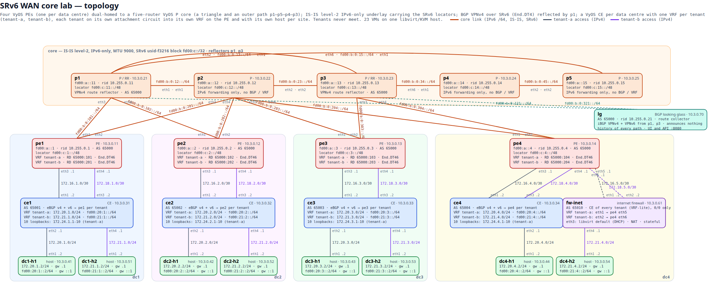

| Role | Nodes | What they do |
|---|---|---|
| P routers | p1, p2, p3 | the core triangle: IS-IS, SRv6, plain IPv6 forwarding. **p1 and p3** are also BGP route reflectors; **p2** runs no BGP at all |
| PE routers | pe1 – pe4 | one per data centre: the tenant VRFs, the eBGP sessions to the CEs, SRv6 encapsulation and decapsulation |
| CE routers | ce1 – ce4 | the customer side of each site: one VRF per tenant, a LAN per tenant, ten extra loopbacks for tenant-a |
| Hosts | dc*n*-h1 (tenant-a), dc*n*-h2 (tenant-b) | Alpine Linux with ping, traceroute, iperf3, tcpdump — the "customers" |
| fw-inet | one firewall on pe4 | a CE of every tenant that gives each site a NAT'd way out to the internet |
| lg | the looking glass | a passive route collector, fed by the route reflectors over BMP, with history, packet capture and path tracing |
| NMS | Prometheus, VictoriaMetrics, Grafana, Gitea | monitoring, alerting, the CI runner's Git mirror |

pe1 and pe2 hang off p1 and p2; pe3 and pe4 off p2 and p3. So every west↔east path crosses **p2** by default — a fact the tests and the steering examples use.

### Addressing at a glance

| What | Range | Example |
|---|---|---|
| Loopbacks (core) | `fd00:a::/48` | pe1 `fd00:a::1`, p2 `fd00:a::12` |
| Core links | `fd00:b:0:<ab>::/64` | p2–pe1 `fd00:b:0:201::/64` |
| SRv6 locators | `fd00:c:<node>::/48` from block `fd00:c::/32` | pe3 `fd00:c:3::/48`, p1 `fd00:c:11::/48` |
| tenant-a | circuits `172.16.n.0/30`, LANs `172.20.n.0/24` | dc3-h1 = `172.20.3.2` |
| tenant-b | circuits `172.18.n.0/30`, LANs `172.21.n.0/24` | dc3-h2 = `172.21.3.2` |
| IPv6 twins | `172.X.Y.0` ↔ `fd00:X:Y::/64` | LAN `172.20.1.0/24` ↔ `fd00:20:1::/64` |
| Management (OOB) | `10.3.0.0/24` | pe1 `10.3.0.11`, dc1-h1 `10.3.0.41` |

### Driving it

```
./lab.sh up          # start every VM (about six minutes from cold)
./lab.sh status      # every node and link with its addresses
./lab.sh ssh pe1     # a router (vyos / vyos); hosts are lab / lab
./lab.sh verify      # adjacencies, SIDs, VPN routes, the host ping matrix
./lab.sh test        # the Robot Framework suites
./lab.sh down        # shut everything down; configurations are saved
```

## 11. Stop 1 — the provisioning portal

The portal (`http://<lab-host>:8091`) is where tenants are created, changed and watched. Everything it does goes through the same steps an engineer would take — edit `lab.conf`, render configurations, push them over SSH, update Nautobot, verify, test — as a **run** you can follow line by line.

**Tenants.** One card per tenant with every site: the PE port, route distinguisher, attachment circuit, CE ports, LAN and host, joined with live state read from the routers — the eBGP session to the CE, how many routes the VRF holds, how many of them go through SRv6, and the tenant's End.DT46 SID on that PE.

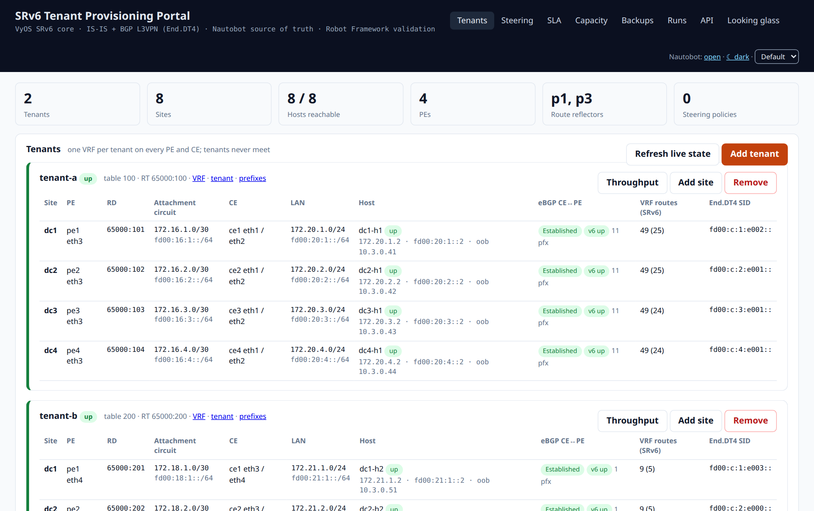

**Topology.** The same network drawn live, hosts coloured by whether they answer. **Add tenant** opens a three-step wizard that suggests everything (letter, table, route target, ports, addresses, hosts), re-validates it against the running lab, and deploys it as a run.

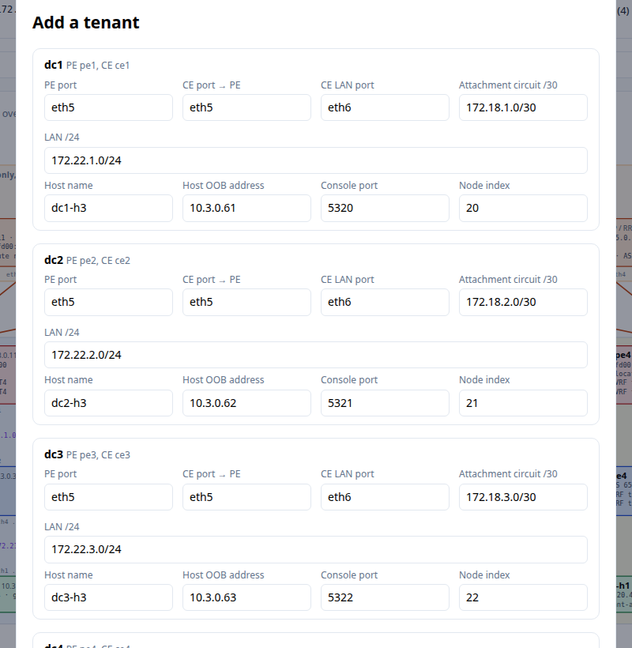

**Steering — on the map.** Pin a tenant prefix on a PE to a path through chosen P routers. **Preview** draws the path before it is applied: the dashed grey line is the IGP shortest path, the coloured one the path the policy would take. After **Apply**, **Measure delay** pings both from the PE inside the tenant's VRF.

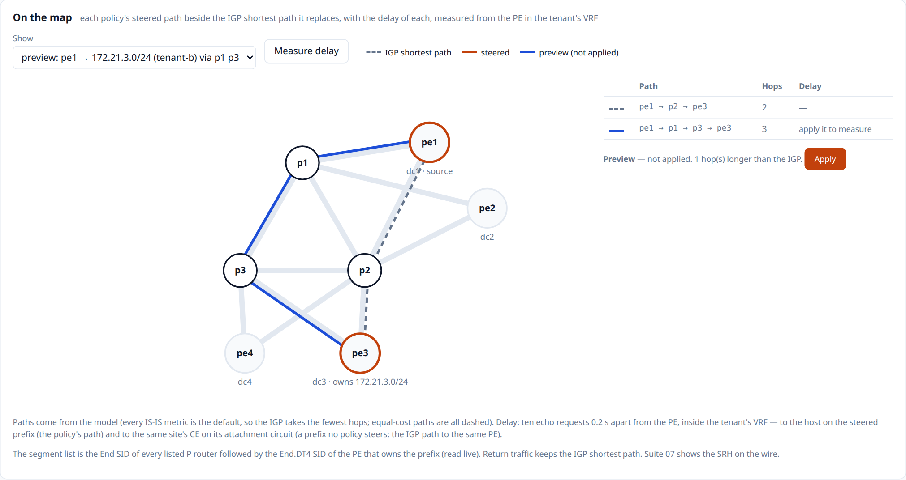

**SLA.** Every minute each tenant host pings every other site of its tenant, and each pair is graded against delay and loss targets. The matrix shows the last probe; a pair's history is one click away. A pair that changes state is annotated in Grafana, and alert rules fire on the same numbers.

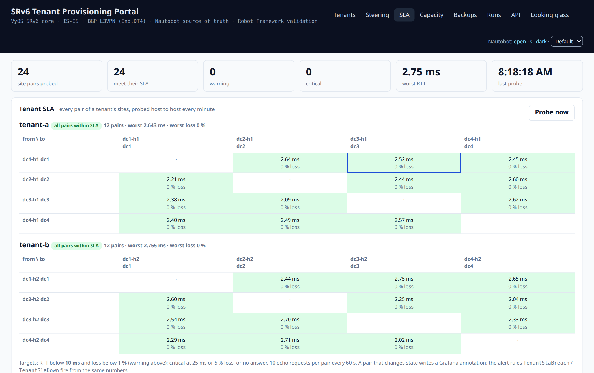

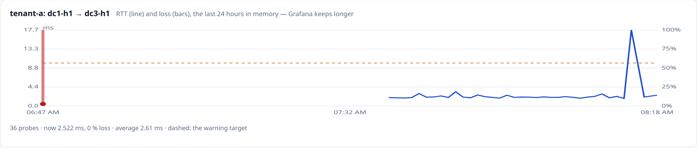

**Capacity.** How many more tenants fit — at every data centre and at each one — and which limit runs out first: PE or CE ports, tenant letters, address blocks, firewall circuits, host memory.

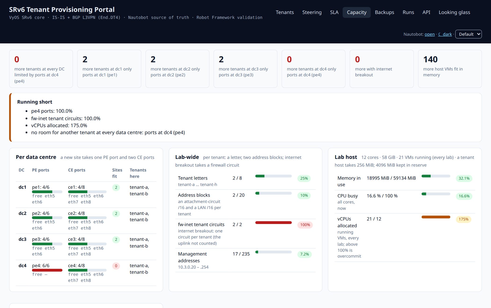

**Backups.** The whole lab state in one checksummed file (`lab.conf`, the steering policies, every router's configuration). A restore first shows its plan — tenants to add or remove, steering to put back — and then runs like any other change.

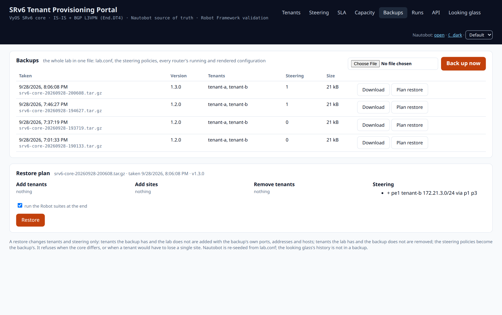

**Runs.** Every change as steps with a streamed log and, at the end, the Robot Framework report. A failed run can be resumed from the step that failed.

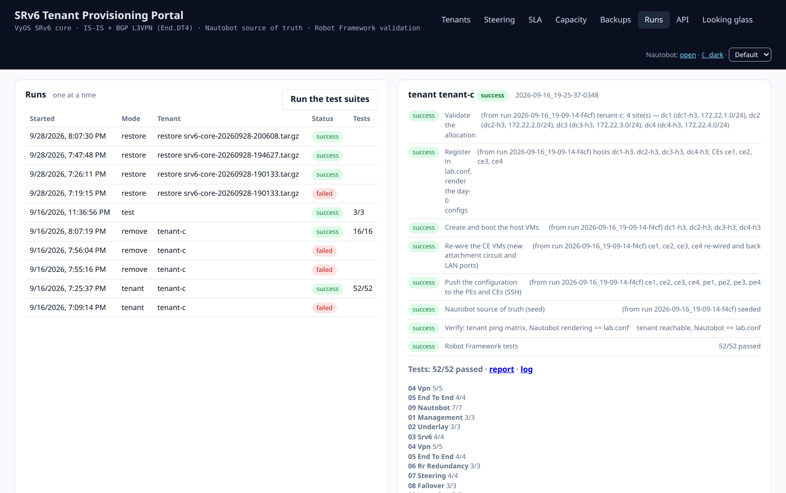

<div class="callout tip"><b>Themes.</b> The picker in the portal's header switches between the default layout and an Apple-style theme; ☾ / ☀ switches dark and light in either. The looking glass has the same picker.</div>

## 12. Stop 2 — the BGP looking glass

The looking glass (`http://10.3.0.70:8080`) is a **passive route collector** inside the core. It holds every VPN route with the attributes the PE gave it, and it also reads each router's own tables over the router API. Everything it sees is kept as history, so you can ask what the network looked like at any moment.

**How the routes get there: BMP.** The two route reflectors *push* their tables to the looking glass over **BMP**, the BGP Monitoring Protocol (RFC 7854). Each reflector opens a connection to it, replays its whole table once, and from then on sends a copy of every update as it happens, so the looking glass is never more than a moment behind. Two copies of the table come with each update:

- the reflector's **Loc-RIB**: its own best routes, the ones it reflects to the PEs. This is "the core's VPN table".
- its **Adj-RIB-In, before policy**: every route exactly as each PE sent it. The looking glass shows this as a separate view, **sent by the PEs**, so you can tell what a PE announced apart from what the reflector made of it.

On p1 the connection looks like this. It monitors the VPNv4 and VPNv6 tables, both before policy and the Loc-RIB:

```
p1> show bmp
{{p1-show-bmp}}
```

The looking glass decodes BMP itself, down to the SRv6 SID (Step 4 shows one route). Every row it shows says how it arrived: **BMP Loc-RIB**, **BMP pre-policy**, or the router's API or SSH.

*Why not an ordinary BGP session?* Until version 1.7 the looking glass held one, as a client of each reflector. That works, but a client only ever receives the reflector's best route, never what each PE actually sent, and it gets nothing about the reflector's own sessions. BMP gives all three. (`LG_FEED=session` in `lab.conf` still switches back.)

**Overview.** The BMP feeds from both reflectors, the size of the VPN table, recent churn, and the topology — click any link to capture its packets.

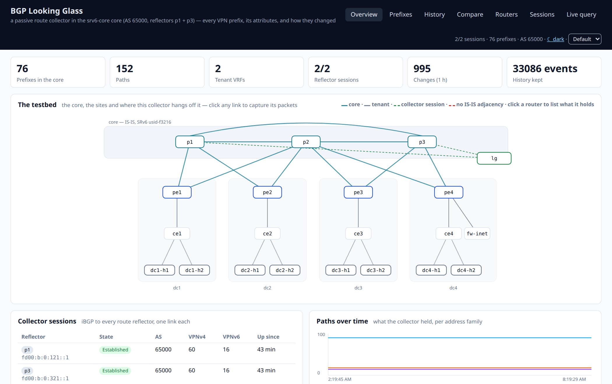

**Prefixes.** Every VPN prefix with its route distinguisher, route target, next hop and the SRv6 SID it points to, filterable by VRF, RD, origin AS or free text.

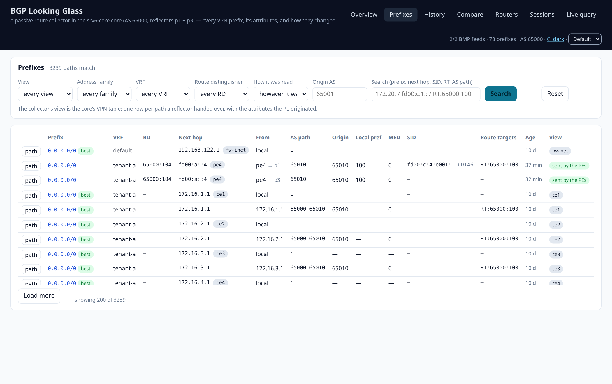

**Path.** For one prefix, the path a packet really takes: from the ingress PE's VRF, through the P router the PE actually forwards through, to the egress PE and its SID — read from the routers, not guessed.

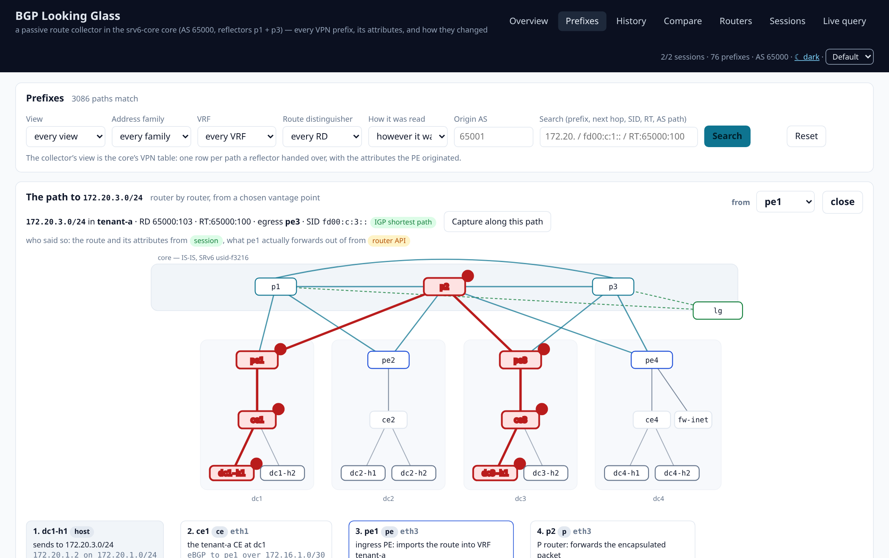

**History and Compare.** Every announce, change and withdraw, with a time slider that shows any table as it was. Compare lists every path that moved between two moments, down to a single next hop's SID.

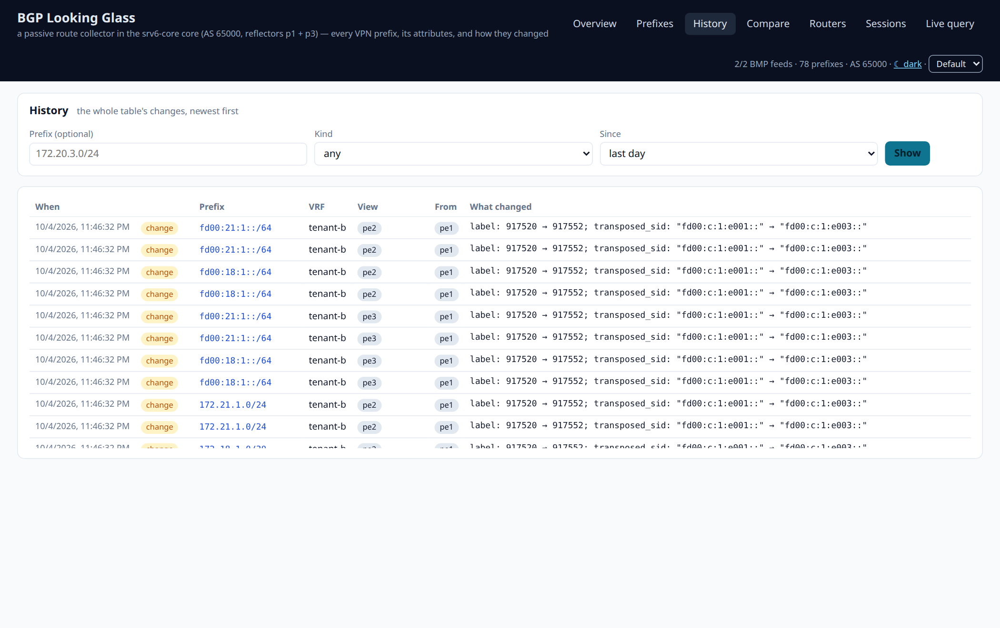

**Sent by the PEs.** Choose the view *sent by the PEs* on the Prefixes page: one row for each route each PE announced, once per reflector that heard it (*From* says `pe1 → p1`). Here are tenant-a's LANs as their PEs sent them. The SID column shows the full SID each route leads to, with the transposed function put back.

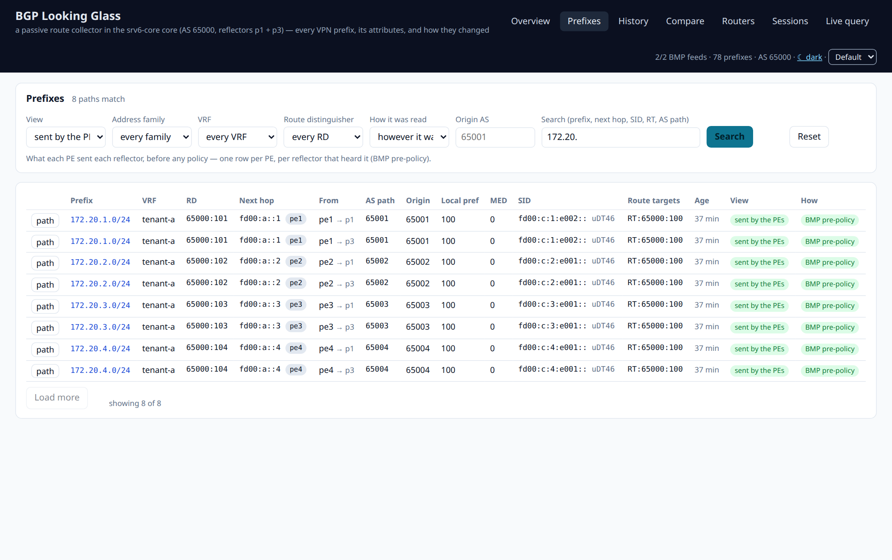

**Sessions.** The BMP feeds (connected, finished replaying, how many routes each holds) and, below them, every reflector's own BGP sessions to the PEs as the reflector reports them. A session that went down says why.

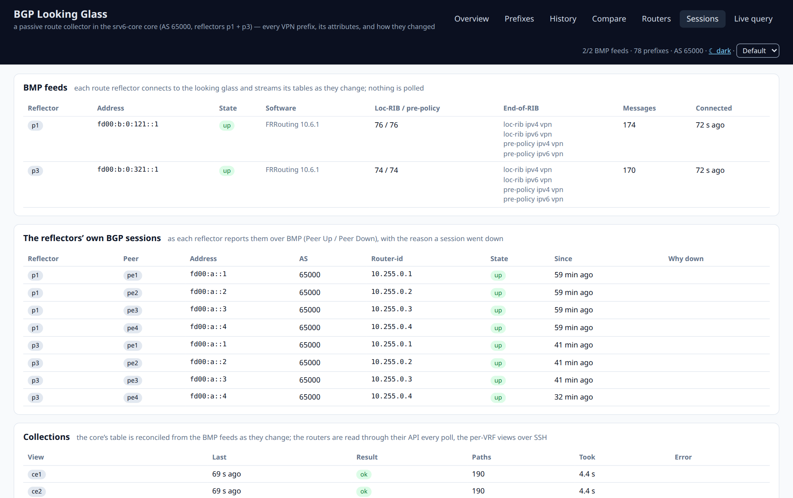

**Packet capture.** Click any link on the map to capture on it — live, streamed into the page — or capture along a prefix's whole path at once and watch each ping hop by hop: plain IPv4 on the access links, SRv6-encapsulated in the core.

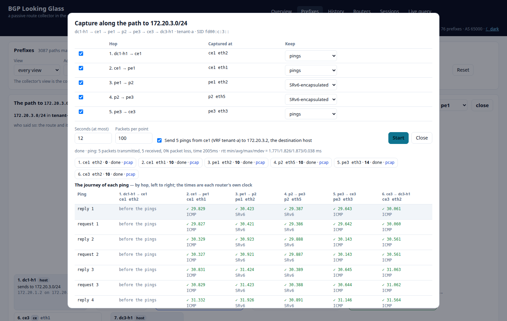

## 13. Stop 3 — Nautobot, the source of truth

Nautobot holds the lab as a model: devices, interfaces, cables, IP addresses, VRFs with their RDs and RTs, BGP peerings. It is seeded from `lab.conf`, and the lab checks itself against it both ways — the configuration Nautobot would render must equal the one `lab.conf` renders, and every line must be present on the routers.

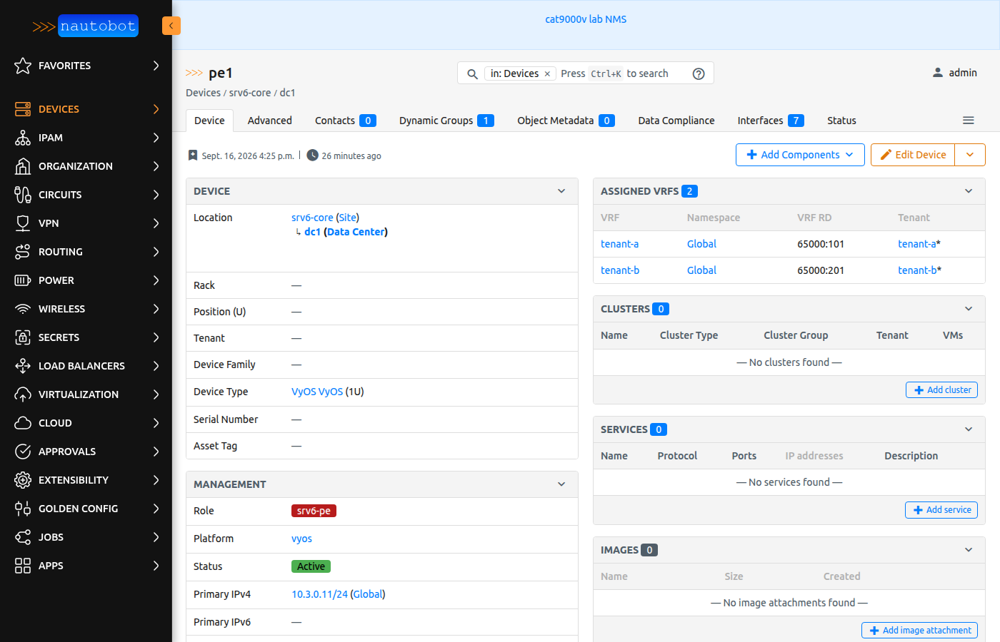

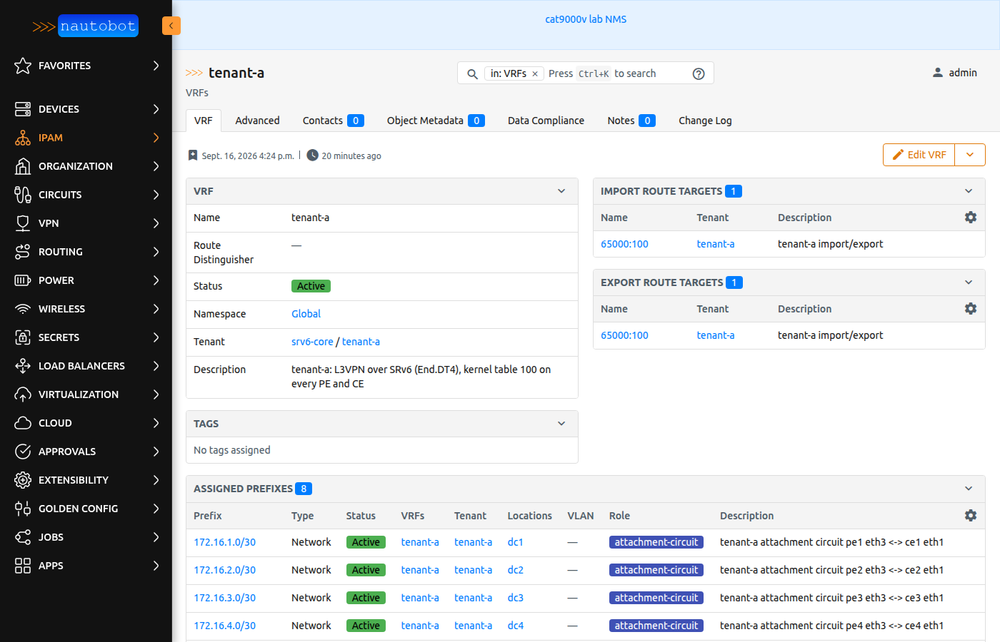

## 14. Stop 4 — monitoring and alerting

The NMS VM runs **Prometheus** (scraping node-exporter and frr-exporter on every router, node-exporter on every host, and the portal's own `/metrics`), **VictoriaMetrics** for longer retention, **VictoriaLogs** for every router's syslog, and **Grafana** for dashboards. Alert rules cover the things an operator cares about: a host or a CE session down, an IS-IS or BFD adjacency missing, a VPN session down, a tenant outside its SLA, failed tests, and a notice when there is no room left for another tenant. Portal runs, steering changes and SLA state changes all appear as annotations on every dashboard.

## 15. Stop 5 — tests and CI

`./lab.sh test` runs sixteen Robot Framework suites — 109 checks — against the live lab: management, the underlay, SRv6, the VPNs, end to end reachability, route-reflector redundancy, steering, failover (a link cut with BFD: 4 packets lost), Nautobot, throughput, monitoring, dual-stack, internet breakout, the looking glass and the portal's operations features. Before and after, every router's configuration and routing tables are saved; the difference must be empty. Each push to GitHub is mirrored to a local Gitea whose runner validates the configurations and runs the suites.

<div class="part-banner"><span>Part 3</span>Walk a packet through it</div>

## 16. Before you start

Open two terminals on the lab host. Everything below uses `./lab.sh ssh <node>` to log in (VyOS routers: `vyos`/`vyos`; hosts: `lab`/`lab`). On a VyOS router, `pe1>` marks the operational CLI (`show …`) and `pe1$` the Linux shell underneath (`ip …`, `tcpdump`), where the SRv6 forwarding actually happens, where the SRv6 forwarding actually happens. We follow one ping from **dc1-h1** (tenant-a, data centre 1) to **dc3-h1** (tenant-a, data centre 3).

## 17. Step 1 — the customer's view

On dc1-h1 the world is small: an address on its LAN and a default route to its CE.

```
dc1-h1$ ip -br addr; ip route
{{dc1-h1-ip}}
```

It reaches the tenant-a host in data centre 3…

```
dc1-h1$ ping -c 3 172.20.3.2
{{dc1-h1-ping-dc3-h1}}
```

…and **cannot** reach the tenant-b host in its own data centre, one hop away on the same CE:

```
dc1-h1$ ping -c 2 172.21.1.2
{{dc1-h1-ping-dc1-h2}}
```

The traceroute shows the customer never sees the core: the hop between the two PEs is invisible (`*`), because inside the core the packet is inside an IPv6 envelope.

```
dc1-h1$ traceroute -n 172.20.3.2
{{dc1-h1-traceroute}}
```

## 18. Step 2 — the underlay: IS-IS and the locators

On pe1, IS-IS has two neighbours — the P routers it is cabled to:

```
pe1> show isis neighbor
{{pe1-isis-neighbor}}
```

pe1 owns one locator, and it is up:

```
pe1> show segment-routing srv6 locator
{{pe1-locator}}
```

Through IS-IS, pe1 has learnt every other router's locator as an ordinary IPv6 route. pe3's `fd00:c:3::/48` goes via p2 (the `fe80::…603` neighbour on eth2) — the IGP shortest path:

```
pe1$ vtysh -c 'show ipv6 route isis' | grep fd00:c: | head -12
{{pe1-ipv6-route-locators}}
```

## 19. Step 3 — the instructions pe1 will carry out

The kernel's table of local SIDs is where behaviours become real. On pe1: the node SID (End, *uN*) on the whole locator, one End.X (*uA*) per core link, and one End.DT46 per tenant VRF:

```
pe1$ ip -6 route show | grep seg6local
{{pe1-seg6local}}
```

<div class="callout note"><b>Read it as a sentence.</b> "<code>fd00:c:1:e00x:: … action End.DT46 vrftable tenant-a</code>" means: <i>a packet addressed to this SID is to be unwrapped and looked up in tenant-a's table.</i> The function values (<code>e000</code>, <code>e001</code> …) are chosen by FRR when the SIDs are allocated, so they can differ between your lab and this guide.</div>

## 20. Step 4 — BGP: which SID leads to which customer

pe3 learnt `172.20.3.0/24` from ce3, allocated an End.DT46 SID for tenant-a, and advertised both to the route reflectors. pe1 receives the route twice (once from each reflector), tagged with route target `65000:100` — which is why only VRF tenant-a imports it:

```
pe1> show bgp ipv4 vpn 172.20.3.0/24
{{pe1-bgp-vpn-prefix}}
```

The "Remote SID" line and the "Remote labels" value together make the full SID: BGP sends the locator part in the SID field and the function in the label field ("transposition"), which saves space when many routes share a locator.

The looking glass receives the same route from the reflectors over BMP and does that sum for you. Here it is as it holds it:

```
GET http://10.3.0.70:8080/api/prefixes?source=collector&vrf=tenant-a&prefix=172.20.3.0/24&best_only=1
{{lg-route-bmp}}
```

The SID field carries only `fd00:c:3::`, pe3's locator. The structure says 16 bits were moved out of it (`transpositionLen`), from bit 48 onwards (`transpositionOffset`). Those 16 bits travel at the top of the 24-bit label field, `0xE00100`. FRR prints that field as the 20-bit label value 917520, which is `0xE0010`. Put `e001` back at bit 48 and you get `fd00:c:3:e001::`: pe3's uDT46 instruction for tenant-a, the same SID Step 7 finds installed on pe3.

## 21. Step 5 — the VRF: where encapsulation is decided

pe1's tenant-a table now says, for `172.20.3.0/24`: *wrap it in SRv6, one segment, pe3's tenant-a SID, out towards p2.* Local sites go straight to the CE; remote ones all have an `encap seg6` instruction:

```
pe1$ ip route show vrf tenant-a
{{pe1-route-vrf|22}}
```

## 22. Step 6 — on the wire in the core

Capture on p2 while dc1-h1 pings. Each packet is an IPv6 packet from pe1's loopback to pe3's SID, with a one-entry SRH (`RT6 … type=4`), and the customer's IPv4 packet inside it:

```
p2$ sudo tcpdump -ni eth5 -c 4 -vv 'ip6 and dst net fd00:c:3::/48'     # eth5 = the link to pe3
{{p2-tcpdump-srv6}}
```

And p2 has no idea who the customers are. It has no VRFs, and its IPv4 table holds only the management network:

```
p2$ ip route show vrf tenant-a; ip vrf show
{{p2-route-vrf}}
p2$ ip route show      # IPv4
{{p2-routes-v4}}
```

That is the whole point of SRv6: the core carries VPN traffic with nothing but IPv6 routing.

## 23. Step 7 — delivery at pe3

pe3's SID table has the matching End.DT46 entries. A packet addressed to the tenant-a one is unwrapped and handed to VRF tenant-a, which knows `172.20.3.0/24` is behind ce3:

```
pe3$ ip -6 route show | grep End.DT4
{{pe3-seg6local}}
```

## 24. Step 8 — choose the path yourself

By default everything west↔east crosses p2. Pin tenant-b's traffic from pe1 to `172.21.3.0/24` onto the long way round, p1 → p3 → pe3. The steering tool builds a single uSID carrier from the path:

```
$ ./lab.sh steer add pe1 tenant-b 172.21.3.0/24 p1 p3
{{steer-add}}
```

Now capture on p1 and then on p3 while dc1-h2 pings dc3-h2. Watch the destination address shrink by one micro-SID at each hop — exactly Figure 5:

```
p1$ sudo tcpdump -ni eth2 -c 2 -vv 'ip6 and dst net fd00:c::/32'   # leaving p1 towards p3: its own 11 consumed
{{p1-tcpdump-steered}}
```

```
p3$ sudo tcpdump -ni eth3 -c 2 -vv 'ip6 and dst net fd00:c::/32'   # leaving p3 towards pe3: only pe3's SID is left
{{p3-tcpdump-steered}}
```

The reply still takes the shortest path back through p2: steering is per direction. Remove the policy and traffic returns to the IGP path:

```
$ ./lab.sh steer del pe1 tenant-b 172.21.3.0/24
{{steer-del}}
```

<div class="callout tip"><b>Same thing, in the portal.</b> In the portal's Steering view, choose pe1, tenant-b, 172.21.3.0/24, via <code>p1 p3</code>, and press <b>Preview</b> to see the path on the map; <b>Apply</b> installs it; <b>Measure delay</b> compares it with the IGP path (the long way is roughly one millisecond longer).</div>

## 25. Step 9 — break something

Every core adjacency runs **BFD**, which notices a dead neighbour in under a second (the links are tunnels that never lose carrier, so without BFD it would take IS-IS's 30-second hold time):

```
pe1> show bfd peers brief
{{pe1-bfd}}
```

Suite 08 (`./lab.sh test suites/08_failover.robot`) cuts the p2–pe3 link silently while a ping runs every 0.2 s: pe3's routes move to p3 within a second, about four packets are lost, and everything comes back when the link is restored. Try it, and watch the looking glass's History view and the SLA matrix while it happens.

## 26. Where to go next

- **Exercises.** `docs/session/exercises.md` has break-and-fix exercises for the lab.
- **The deep dive.** `docs/srv6-walkthrough.pdf` goes table by table through dual-stack (End.DT46 for IPv6), the internet breakout, the Linux quirk the PEs work around, and more.
- **Add a tenant** from the portal and follow the run — then find its new SIDs on the PEs, its routes in the looking glass, and its sites in the SLA matrix.
- **Watch BMP at work.** Shut a CE's BGP session for a minute: the looking glass's History shows the withdraw within a couple of seconds, *sent by the PEs* loses the route, and Sessions keeps showing every reflector-to-PE session up, because only the CE side went down.
- **Standards.** RFC 8402 (Segment Routing architecture), RFC 8754 (the SRH), RFC 8986 (SRv6 network programming — the behaviours), RFC 9252 (BGP services over SRv6 — the L3VPN), RFC 9352 (IS-IS extensions for SRv6), RFC 9800 (compressed SIDs — uSID).
